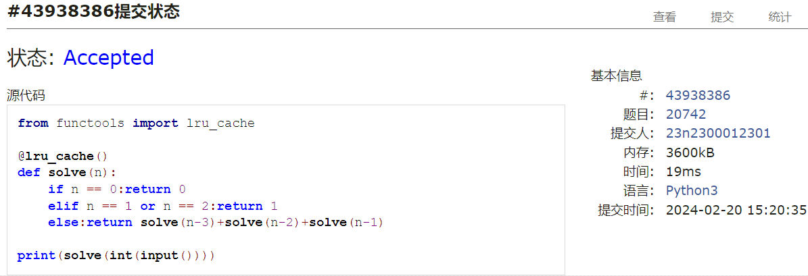
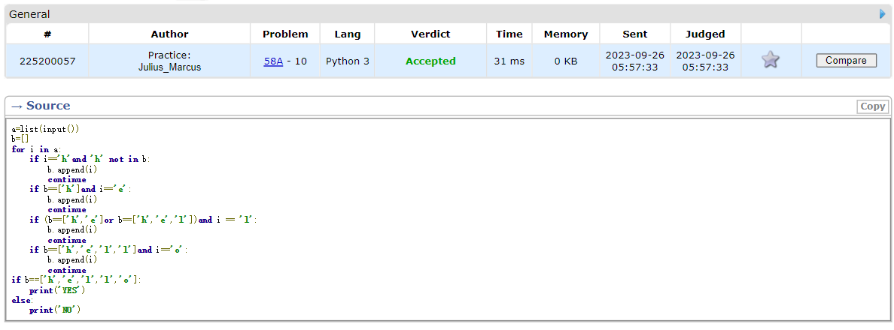
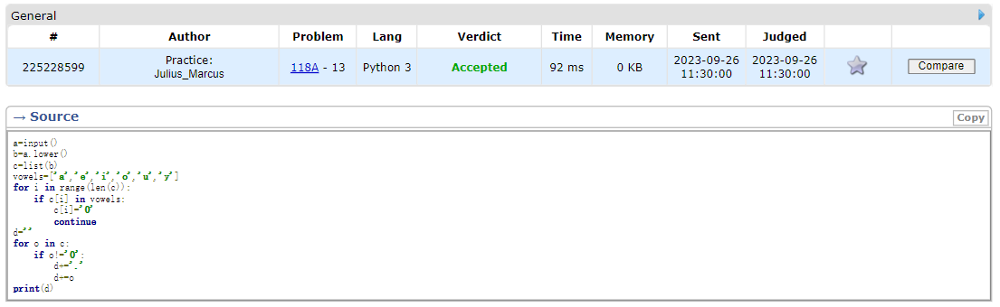
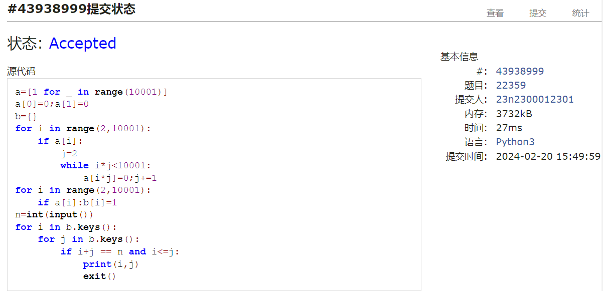
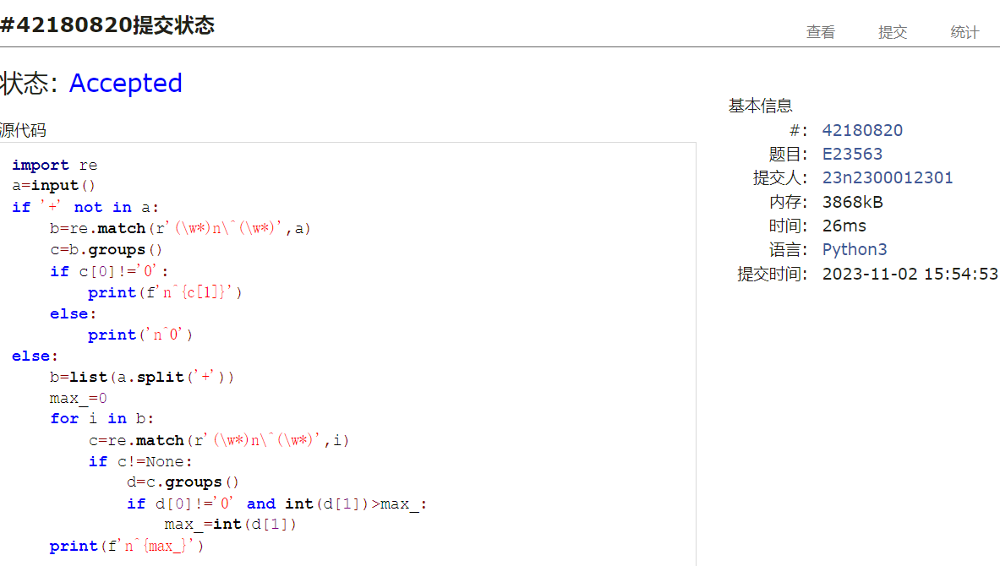
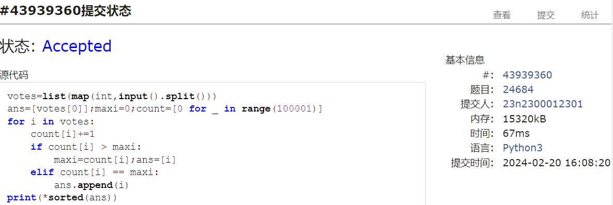

# Assignment #1: 拉齐大家Python水平

Updated 0940 GMT+8 Feb 19, 2024

2024 spring, Complied by ==周百川，生命科学学院==


**说明：**

1）数算课程的先修课是计概，由于计概学习中可能使用了不同的编程语言，而数算课程要求Python语言，因此第一周作业练习Python编程。如果有同学坚持使用C/C++，也可以，但是建议也要会Python语言。

2）请把每个题目解题思路（可选），源码Python, 或者C++（已经在Codeforces/Openjudge上AC），截图（包含Accepted），填写到下面作业模版中（推荐使用 typora https://typoraio.cn ，或者用word）。AC 或者没有AC，都请标上每个题目大致花费时间。

3）课程网站是Canvas平台, https://pku.instructure.com, 学校通知3月1日导入选课名单后启用。**作业写好后，保留在自己手中，待3月1日提交。**

提交时候先提交pdf文件，再把md或者doc文件上传到右侧“作业评论”。Canvas需要有同学清晰头像、提交文件有pdf、"作业评论"区有上传的md或者doc附件。

4）如果不能在截止前提交作业，请写明原因。


**编程环境**

==（请改为同学的操作系统、编程环境等）==

操作系统：windows 11

Python编程环境：PyCharm 2023.1.4 (Community Edition)

C/C++编程环境：Visual Studio 2022


## 1. 题目

### 20742: 泰波拿契數

http://cs101.openjudge.cn/practice/20742/


思路：

递归+lru_cache.

##### 代码

```python
from functools import lru_cache

@lru_cache()
def solve(n):
    if n == 0:return 0
    elif n == 1 or n == 2:return 1
    else:return solve(n-3)+solve(n-2)+solve(n-1)

print(solve(int(input())))

```


代码运行截图 ==（至少包含有"Accepted"）==



### 58A. Chat room

greedy/strings, 1000, http://codeforces.com/problemset/problem/58/A


思路：

分步尝试对齐目标字符串，其实可以用正则优化的，这里直接把之前写的代码搬上来了。

##### 代码

```python
a=list(input())
b=[]
for i in a:
    if i=='h'and 'h' not in b:
        b.append(i)
        continue
    if b==['h']and i=='e':
        b.append(i)
        continue
    if (b==['h','e']or b==['h','e','l'])and i == 'l':
        b.append(i)
        continue
    if b==['h','e','l','l']and i=='o':
        b.append(i)
        continue
if b==['h','e','l','l','o']:
    print('YES')
else:
    print('NO')

```


代码运行截图 ==（至少包含有"Accepted"）==



### 118A. String Task

implementation/strings, 1000, http://codeforces.com/problemset/problem/118/A


思路：

依次替换即可。

##### 代码

```python
a=input()
b=a.lower()
c=list(b)
vowels=['a','e','i','o','u','y']
for i in range(len(c)):
    if c[i] in vowels:
        c[i]='0'
        continue
d=''
for o in c:
    if o!='0':
        d+='.'
        d+=o
print(d)

```


代码运行截图 ==（AC代码截图，至少包含有"Accepted"）==



### 22359: Goldbach Conjecture

http://cs101.openjudge.cn/practice/22359/


思路：

素数筛+两层循环。

##### 代码

```python
a=[1 for _ in range(10001)]
a[0]=0;a[1]=0
b={}
for i in range(2,10001):
    if a[i]:
        j=2
        while i*j<10001:
            a[i*j]=0;j+=1
for i in range(2,10001):
    if a[i]:b[i]=1
n=int(input())
for i in b.keys():
    for j in b.keys():
        if i+j == n and i<=j:
            print(i,j)
            exit()

```


代码运行截图 ==（AC代码截图，至少包含有"Accepted"）==



### 23563: 多项式时间复杂度

http://cs101.openjudge.cn/practice/23563/


思路：

正则提取关键字再处理即可。

##### 代码

```python
import re
a=input()
if '+' not in a:
    b=re.match(r'(\w*)n\^(\w*)',a)
    c=b.groups()
    if c[0]!='0':
        print(f'n^{c[1]}')
    else:
        print('n^0')
else:
    b=list(a.split('+'))
    max_=0
    for i in b:
        c=re.match(r'(\w*)n\^(\w*)',i)
        if c!=None:
            d=c.groups()
            if d[0]!='0' and int(d[1])>max_:
                max_=int(d[1])
    print(f'n^{max_}')

```


代码运行截图 ==（AC代码截图，至少包含有"Accepted"）==



### 24684: 直播计票

http://cs101.openjudge.cn/practice/24684/


思路：

依次计票即可，注意存储用的数据结构。

##### 代码

```python
votes=list(map(int,input().split()))
ans=[votes[0]];maxi=0;count=[0 for _ in range(100001)]
for i in votes:
    count[i]+=1
    if count[i] > maxi:
        maxi=count[i];ans=[i]
    elif count[i] == maxi:
        ans.append(i)
print(*sorted(ans))

```


代码运行截图 ==（AC代码截图，至少包含有"Accepted"）==



## 2. 学习总结和收获

==如果作业题目简单，有否额外练习题目，比如：OJ“数算pre每日选做”、CF、LeetCode、洛谷等网站题目。==

目前作业的题目难度不大，有很多在上学期的计概课程中已经做过。接下来会多加练习一些更接近数算课程定位的题目。


