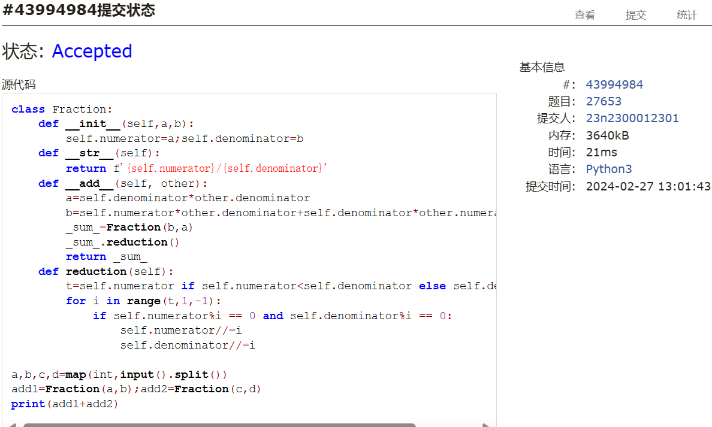
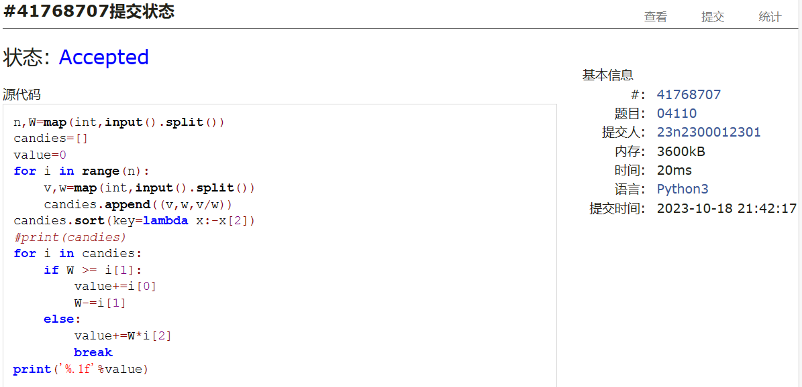
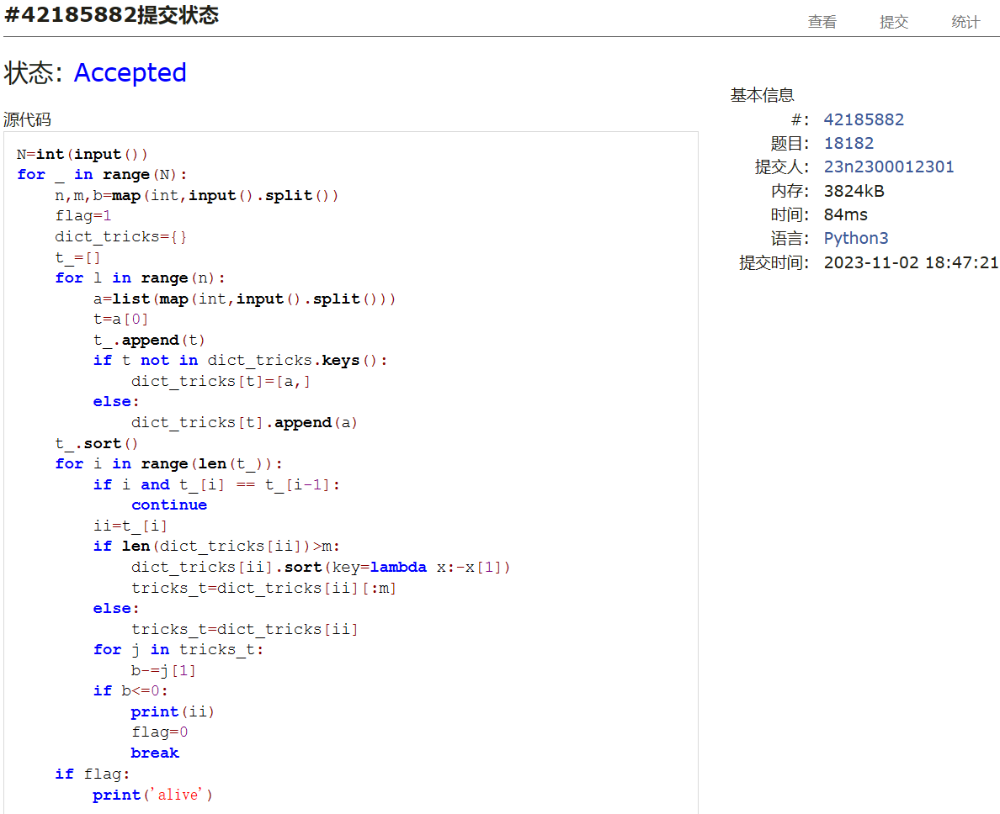
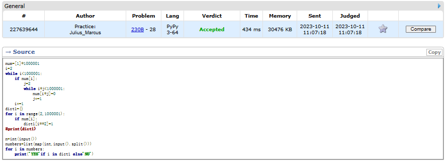
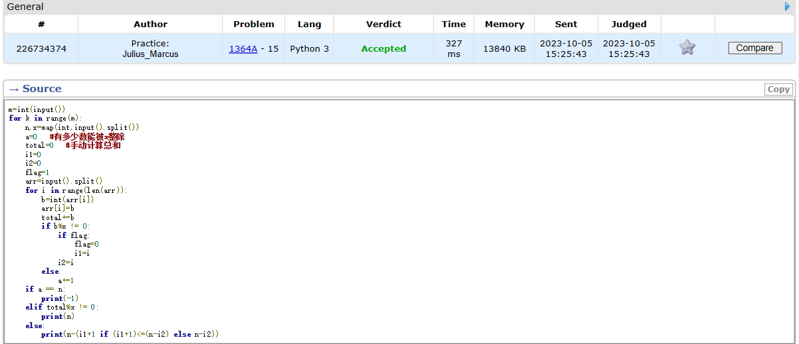
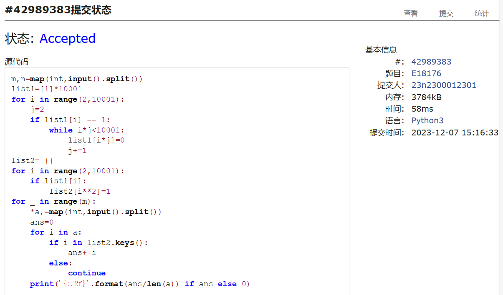

# Assignment #2: 编程练习

Updated 0953 GMT+8 Feb 24, 2024

2024 spring, Complied by ==周百川，生命科学学院==


**说明：**

1）The complete process to learn DSA from scratch can be broken into 4 parts:
- Learn about Time and Space complexities
- Learn the basics of individual Data Structures
- Learn the basics of Algorithms
- Practice Problems on DSA

2）请把每个题目解题思路（可选），源码Python, 或者C++（已经在Codeforces/Openjudge上AC），截图（包含Accepted），填写到下面作业模版中（推荐使用 typora https://typoraio.cn ，或者用word）。AC 或者没有AC，都请标上每个题目大致花费时间。

3）课程网站是Canvas平台, https://pku.instructure.com, 学校通知3月1日导入选课名单后启用。**作业写好后，保留在自己手中，待3月1日提交。**

提交时候先提交pdf文件，再把md或者doc文件上传到右侧“作业评论”。Canvas需要有同学清晰头像、提交文件有pdf、"作业评论"区有上传的md或者doc附件。

4）如果不能在截止前提交作业，请写明原因。


**编程环境**

==（请改为同学的操作系统、编程环境等）==

操作系统：windows 11 

Python编程环境：PyCharm 2023.1.4 (Community Edition)

C/C++编程环境：Visual Studio 2022


## 1. 题目

### 27653: Fraction类

http://cs101.openjudge.cn/2024sp_routine/27653/


思路：

练习一下类的基本写法，构造、重载等等。

##### 代码

```python
class Fraction:
    def __init__(self,a,b):
        self.numerator=a;self.denominator=b
    def __str__(self):
        return f'{self.numerator}/{self.denominator}'
    def __add__(self, other):
        a=self.denominator*other.denominator
        b=self.numerator*other.denominator+self.denominator*other.numerator
        _sum_=Fraction(b,a)
        _sum_.reduction()
        return _sum_
    def reduction(self):
        t=self.numerator if self.numerator<self.denominator else self.denominator
        for i in range(t,1,-1):
            if self.numerator%i == 0 and self.denominator%i == 0:
                self.numerator//=i
                self.denominator//=i

a,b,c,d=map(int,input().split())
add1=Fraction(a,b);add2=Fraction(c,d)
print(add1+add2)

```


代码运行截图 ==（至少包含有"Accepted"）==



### 04110: 圣诞老人的礼物-Santa Clau’s Gifts

greedy/dp, http://cs101.openjudge.cn/practice/04110


思路：


##### 代码

```python
n,W=map(int,input().split())
candies=[]
value=0
for i in range(n):
    v,w=map(int,input().split())
    candies.append((v,w,v/w))
candies.sort(key=lambda x:-x[2])
#print(candies)
for i in candies:
    if W >= i[1]:
        value+=i[0]
        W-=i[1]
    else:
        value+=W*i[2]
        break
print('%.1f'%value)

```


代码运行截图 ==（至少包含有"Accepted"）==



### 18182: 打怪兽

implementation/sortings/data structures, http://cs101.openjudge.cn/practice/18182/


思路：


##### 代码

```python
N=int(input())
for _ in range(N):
    n,m,b=map(int,input().split())
    flag=1
    dict_tricks={}
    t_=[]
    for l in range(n):
        a=list(map(int,input().split()))
        t=a[0]
        t_.append(t)
        if t not in dict_tricks.keys():
            dict_tricks[t]=[a,]
        else:
            dict_tricks[t].append(a)
    t_.sort()
    for i in range(len(t_)):
        if i and t_[i] == t_[i-1]:
            continue
        ii=t_[i]
        if len(dict_tricks[ii])>m:
            dict_tricks[ii].sort(key=lambda x:-x[1])
            tricks_t=dict_tricks[ii][:m]
        else:
            tricks_t=dict_tricks[ii]
        for j in tricks_t:
            b-=j[1]
        if b<=0:
            print(ii)
            flag=0
            break
    if flag:
        print('alive')

```


代码运行截图 ==（AC代码截图，至少包含有"Accepted"）==



### 230B. T-primes

binary search/implementation/math/number theory, 1300, http://codeforces.com/problemset/problem/230/B


思路：


##### 代码

```python
num=[1]*1000001
i=2
while i<1000001:
    if num[i]:
        j=2
        while i*j<1000001:
            num[i*j]=0
            j+=1
    i+=1
dict1={}
for i in range(2,1000001):
    if num[i]:
        dict1[i**2]=1
#print(dict1)

n=int(input())
numbers=list(map(int,input().split()))
for i in numbers:
    print('YES'if i in dict1 else'NO')

```


代码运行截图 ==（AC代码截图，至少包含有"Accepted"）==



### 1364A. XXXXX

brute force/data structures/number theory/two pointers, 1200, https://codeforces.com/problemset/problem/1364/A


思路：


##### 代码

```python
m=int(input())
for k in range(m):
    n,x=map(int,input().split())
    a=0   #有多少数能被x整除
    total=0   #手动计算总和
    i1=0
    i2=0
    flag=1
    arr=input().split()
    for i in range(len(arr)):
        b=int(arr[i])
        arr[i]=b
        total+=b
        if b%x != 0:
            if flag:
                flag=0
                i1=i
            i2=i
        else:
            a+=1
    if a == n:
        print(-1)
    elif total%x != 0:
        print(n)
    else:
        print(n-(i1+1 if (i1+1)<=(n-i2) else n-i2))

```


代码运行截图 ==（AC代码截图，至少包含有"Accepted"）==



### 18176: 2050年成绩计算

http://cs101.openjudge.cn/practice/18176/


思路：


##### 代码

```python
m,n=map(int,input().split())
list1=[1]*10001
for i in range(2,10001):
    j=2
    if list1[i] == 1:
        while i*j<10001:
            list1[i*j]=0
            j+=1
list2= {}
for i in range(2,10001):
    if list1[i]:
        list2[i**2]=1
for _ in range(m):
    *a,=map(int,input().split())
    ans=0
    for i in a:
        if i in list2.keys():
            ans+=i
        else:
            continue
    print('{:.2f}'.format(ans/len(a)) if ans else 0)

```


代码运行截图 ==（AC代码截图，至少包含有"Accepted"）==



## 2. 学习总结和收获

==如果作业题目简单，有否额外练习题目，比如：OJ“2024spring每日选做”、CF、LeetCode、洛谷等网站题目。==

现阶段作业题还是以回顾基本语法为主，有空的话会做一些每日选做的题目来更多的接触数算相关的知识。


