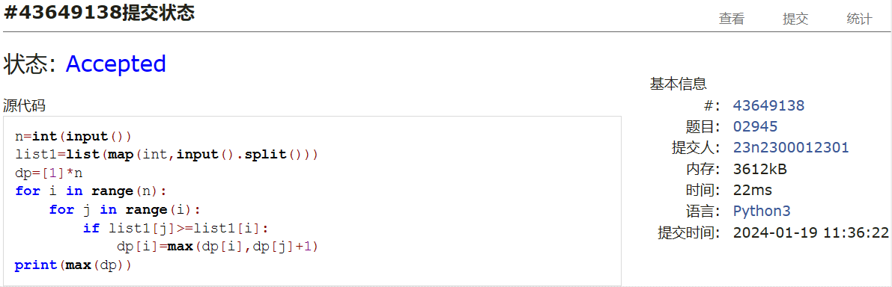
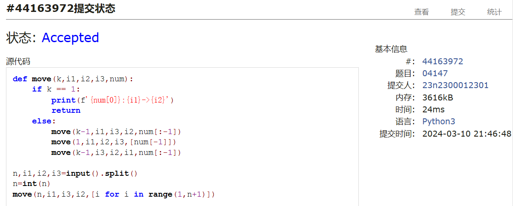
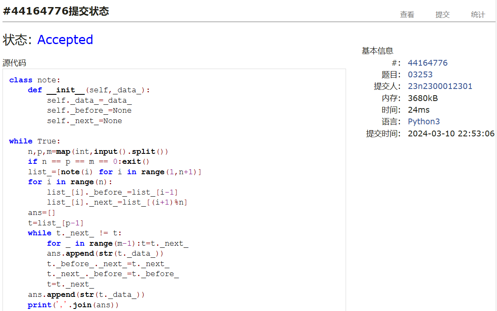
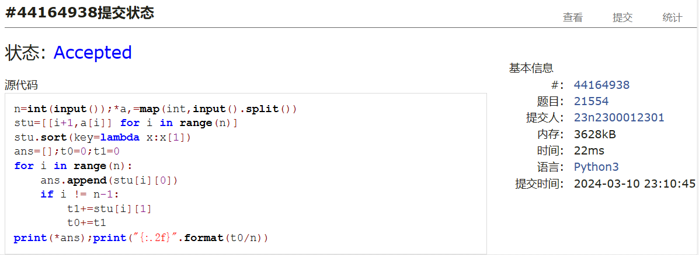
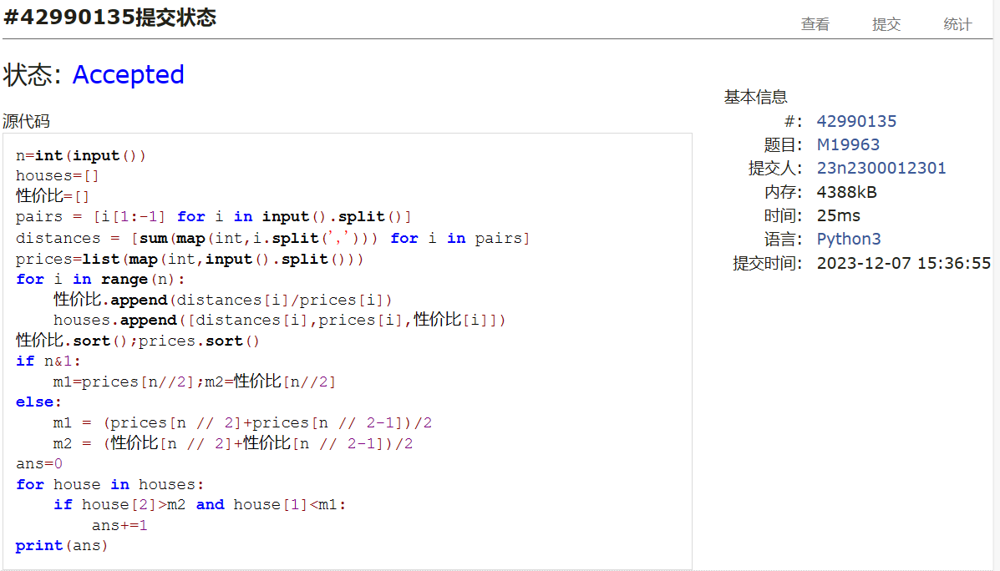
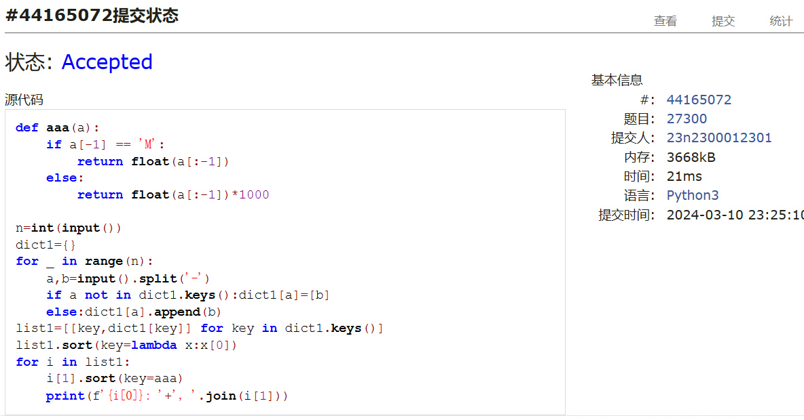

# Assignment #3: March月考

Updated 1537 GMT+8 March 6, 2024

2024 spring, Complied by ==周百川，生命科学学院==


**说明：**

1）The complete process to learn DSA from scratch can be broken into 4 parts:
- Learn about Time and Space complexities
- Learn the basics of individual Data Structures
- Learn the basics of Algorithms
- Practice Problems on DSA

2）请把每个题目解题思路（可选），源码Python, 或者C++（已经在Codeforces/Openjudge上AC），截图（包含Accepted），填写到下面作业模版中（推荐使用 typora https://typoraio.cn ，或者用word）。AC 或者没有AC，都请标上每个题目大致花费时间。

3）提交时候先提交pdf文件，再把md或者doc文件上传到右侧“作业评论”。Canvas需要有同学清晰头像、提交文件有pdf、"作业评论"区有上传的md或者doc附件。

4）如果不能在截止前提交作业，请写明原因。


**编程环境**

==（请改为同学的操作系统、编程环境等）==

操作系统：windows11

Python编程环境：PyCharm 2023.1.4 (Community Edition)

C/C++编程环境：Visual Studio 2022


## 1. 题目

**02945: 拦截导弹**

http://cs101.openjudge.cn/practice/02945/


思路：

实质是求序列的最长下降子序列的dp.

##### 代码

```python
n=int(input())
list1=list(map(int,input().split()))
dp=[1]*n
for i in range(n):
    for j in range(i):
        if list1[j]>=list1[i]:
            dp[i]=max(dp[i],dp[j]+1)
print(max(dp))

```


代码运行截图 ==（至少包含有"Accepted"）==



**04147:汉诺塔问题(Tower of Hanoi)**

http://cs101.openjudge.cn/practice/04147


思路：

题目已经给出了递归的思路，照做即可。

##### 代码

```python
def move(k,i1,i2,i3,num):
    if k == 1:
        print(f'{num[0]}:{i1}->{i2}')
        return
    else:
        move(k-1,i1,i3,i2,num[:-1])
        move(1,i1,i2,i3,[num[-1]])
        move(k-1,i3,i2,i1,num[:-1])

n,i1,i2,i3=input().split()
n=int(n)
move(n,i1,i3,i2,[i for i in range(1,n+1)])

```


代码运行截图 ==（至少包含有"Accepted"）==



**03253: 约瑟夫问题No.2**

http://cs101.openjudge.cn/practice/03253


思路：

试了一下手搓链表，写得不是很熟练。感觉后面需要多加练习。

##### 代码

```python
class note:
    def __init__(self,_data_):
        self._data_=_data_
        self._before_=None
        self._next_=None

while True:
    n,p,m=map(int,input().split())
    if n == p == m == 0:exit()
    list_=[note(i) for i in range(1,n+1)]
    for i in range(n):
        list_[i]._before_=list_[i-1]
        list_[i]._next_=list_[(i+1)%n]
    ans=[]
    t=list_[p-1]
    while t._next_ != t:
        for _ in range(m-1):t=t._next_
        ans.append(str(t._data_))
        t._before_._next_=t._next_
        t._next_._before_=t._before_
        t=t._next_
    ans.append(str(t._data_))
    print(','.join(ans))

```


代码运行截图 ==（AC代码截图，至少包含有"Accepted"）==



**21554:排队做实验 (greedy)v0.2**

http://cs101.openjudge.cn/practice/21554


思路：

简单的贪心问题，排序即可。


##### 代码

```python
n=int(input());*a,=map(int,input().split())
stu=[[i+1,a[i]] for i in range(n)]
stu.sort(key=lambda x:x[1])
ans=[];t0=0;t1=0
for i in range(n):
    ans.append(stu[i][0])
    if i != n-1:
        t1+=stu[i][1]
        t0+=t1
print(*ans);print("{:.2f}".format(t0/n))

```


代码运行截图 ==（AC代码截图，至少包含有"Accepted"）==



**19963:买学区房**

http://cs101.openjudge.cn/practice/19963


思路：


##### 代码

```python
n=int(input())
houses=[]
性价比=[]
pairs = [i[1:-1] for i in input().split()]
distances = [sum(map(int,i.split(','))) for i in pairs]
prices=list(map(int,input().split()))
for i in range(n):
    性价比.append(distances[i]/prices[i])
    houses.append([distances[i],prices[i],性价比[i]])
性价比.sort();prices.sort()
if n&1:
    m1=prices[n//2];m2=性价比[n//2]
else:
    m1 = (prices[n // 2]+prices[n // 2-1])/2
    m2 = (性价比[n // 2]+性价比[n // 2-1])/2
ans=0
for house in houses:
    if house[2]>m2 and house[1]<m1:
        ans+=1
print(ans)

```


代码运行截图 ==（AC代码截图，至少包含有"Accepted"）==



**27300: 模型整理**

http://cs101.openjudge.cn/practice/27300


思路：

排序题目，注意一下数据结构即可。

##### 代码

```python
def aaa(a):
    if a[-1] == 'M':
        return float(a[:-1])
    else:
        return float(a[:-1])*1000

n=int(input())
dict1={}
for _ in range(n):
    a,b=input().split('-')
    if a not in dict1.keys():dict1[a]=[b]
    else:dict1[a].append(b)
list1=[[key,dict1[key]] for key in dict1.keys()]
list1.sort(key=lambda x:x[0])
for i in list1:
    i[1].sort(key=aaa)
    print(f'{i[0]}: '+', '.join(i[1]))

```


代码运行截图 ==（AC代码截图，至少包含有"Accepted"）==



## 2. 学习总结和收获

==如果作业题目简单，有否额外练习题目，比如：OJ“2024spring每日选做”、CF、LeetCode、洛谷等网站题目。==

由于定分实验没来得及参加月考，自己重新做了一遍。上学期学过的一些内容(dp之类)有点忘了，需要重温一下。
也练习了一些新学的知识，比如链表等等。感觉数算课程和封装、面向对象编程之类的思想联系很紧密，在以后的编程中也会试着多去利用这些思想。


