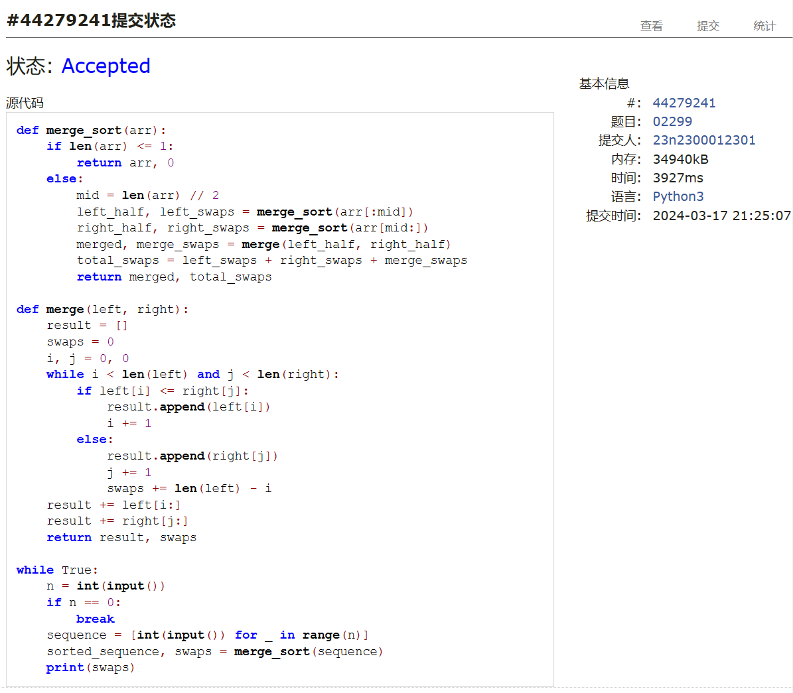

# Assignment #4: 排序、栈、队列和树

Updated 0005 GMT+8 March 11, 2024

2024 spring, Complied by ==同学的姓名、院系==


**说明：**

1）The complete process to learn DSA from scratch can be broken into 4 parts:

Learn about Time complexities, learn the basics of individual Data Structures, learn the basics of Algorithms, and practice Problems.

2）请把每个题目解题思路（可选），源码Python, 或者C++（已经在Codeforces/Openjudge上AC），截图（包含Accepted），填写到下面作业模版中（推荐使用 typora https://typoraio.cn ，或者用word）。AC 或者没有AC，都请标上每个题目大致花费时间。

3）提交时候先提交pdf文件，再把md或者doc文件上传到右侧“作业评论”。Canvas需要有同学清晰头像、提交文件有pdf、"作业评论"区有上传的md或者doc附件。

4）如果不能在截止前提交作业，请写明原因。


**编程环境**

==（请改为同学的操作系统、编程环境等）==

操作系统：macOS Ventura 13.4.1 (c)

Python编程环境：Spyder IDE 5.2.2, PyCharm 2023.1.4 (Professional Edition)

C/C++编程环境：Mac terminal vi (version 9.0.1424), g++/gcc (Apple clang version 14.0.3, clang-1403.0.22.14.1)


## 1. 题目

### 05902: 双端队列

http://cs101.openjudge.cn/practice/05902/


思路：

时间复杂度要求不高，直接用list实现即可。

代码

```python
for _ in range(int(input())):
    n=int(input());nums=[]
    for _ in range(n):
        a,b=map(int,input().split())
        if a == 1:nums.append(b)
        else:
            if b == 0:nums=nums[1:]
            else:nums=nums[:-1]
    if len(nums):print(*nums)
    else:print('NULL')

```


代码运行截图 ==（至少包含有"Accepted"）==


### 02694: 波兰表达式

http://cs101.openjudge.cn/practice/02694/


思路：

递归+正则表达式，正好复习一下正则的相关知识。

代码

```python
import re
def solve(string_):
    if re.search(r'[+\-*/] \d+\.*\d* \d+\.*\d*',string_):
        t=re.findall(r'([+\-*/]) (\d+\.*\d*) (\d+\.*\d*)',string_)
        for i in t:
            t_='\\'+' '.join(i)
            string_=re.sub(t_,str(eval(i[1]+i[0]+i[2])),string_)
        solve(string_)
    else:
        print('{:.6f}'.format(float(string_)))
solve(input())

```


代码运行截图 ==（至少包含有"Accepted"）==
\


### 24591: 中序表达式转后序表达式

http://cs101.openjudge.cn/practice/24591/


思路：

对着题解里的代码学习了一下，大致理解了题目的思路。

代码

```python
def infix_to_postfix(expression):
    precedence = {'+':1, '-':1, '*':2, '/':2}
    stack = [];postfix = []
    number = ''

    for char in expression:
        if char.isnumeric() or char == '.':
            number += char
        else:
            if number:
                num = float(number)
                postfix.append(int(num) if num.is_integer() else num)
                number = ''
            if char in '+-*/':
                while stack and stack[-1] in '+-*/' and precedence[char] <= precedence[stack[-1]]:
                    postfix.append(stack.pop())
                stack.append(char)
            elif char == '(':
                stack.append(char)
            elif char == ')':
                while stack and stack[-1] != '(':
                    postfix.append(stack.pop())
                stack.pop()

    if number:
        num = float(number)
        postfix.append(int(num) if num.is_integer() else num)

    while stack:
        postfix.append(stack.pop())

    return ' '.join(str(x) for x in postfix)

n = int(input())
for _ in range(n):
    expression = input()
    print(infix_to_postfix(expression))

```


代码运行截图 ==（AC代码截图，至少包含有"Accepted"）==


### 22068: 合法出栈序列

http://cs101.openjudge.cn/practice/22068/


思路：

利用出栈/入栈这一过程的性质来倒序解决问题。

代码

```python
def is_valid_pop_sequence(origin, output):
    if len(origin) != len(output):
        return False  # 长度不同，直接返回False
    stack = [];bank = list(origin)
    for char in output:
        # 如果当前字符不在栈顶，且bank中还有字符，则继续入栈
        while (not stack or stack[-1] != char) and bank:
            stack.append(bank.pop(0))
        # 如果栈为空，或栈顶字符不匹配，则不是合法的出栈序列
        if not stack or stack[-1] != char:
            return False
        stack.pop()  # 匹配成功，弹出栈顶元素
    return True  # 所有字符都匹配成功

# 读取原始字符串
origin = input()
# 循环读取每一行输出序列并判断
while True:
    try:
        output = input()
        if is_valid_pop_sequence(origin, output):
            print('YES')
        else:
            print('NO')
    except EOFError:
        break
```


代码运行截图 ==（AC代码截图，至少包含有"Accepted"）==


### 06646: 二叉树的深度

http://cs101.openjudge.cn/practice/06646/


思路：

正常写一棵树+dfs即可。

代码

```python
class note:
    def __init__(self):
        self.father=None
        self.son_left=None
        self.son_right=None
def dfs(t,tree,depth):
    global max_depth
    if t == None:
        if depth>max_depth:max_depth=depth
        return
    dfs(t.son_left,tree,depth+1)
    dfs(t.son_right,tree,depth+1)


n=int(input());max_depth=0
tree=[note() for _ in range(n)]
for i in tree:
    l,r=map(int,input().split())
    if l == -1:i.son_left=None
    else:i.son_left=tree[l-1];tree[l-1].father=i
    if r == -1:i.son_right=None
    else:i.son_right=tree[r-1];tree[r-1].father=i
dfs(tree[0],tree,0)
print(max_depth)

```


代码运行截图 ==（AC代码截图，至少包含有"Accepted"）==


### 02299: Ultra-QuickSort

http://cs101.openjudge.cn/practice/02299/


思路：

学了一下归并排序的算法，在此基础上稍加改动即可。

代码

```python
def merge_sort(arr):
    if len(arr) <= 1:
        return arr, 0
    else:
        mid = len(arr) // 2
        left_half, left_swaps = merge_sort(arr[:mid])
        right_half, right_swaps = merge_sort(arr[mid:])
        merged, merge_swaps = merge(left_half, right_half)
        total_swaps = left_swaps + right_swaps + merge_swaps
        return merged, total_swaps

def merge(left, right):
    result = []
    swaps = 0
    i, j = 0, 0
    while i < len(left) and j < len(right):
        if left[i] <= right[j]:
            result.append(left[i])
            i += 1
        else:
            result.append(right[j])
            j += 1
            swaps += len(left) - i
    result += left[i:]
    result += right[j:]
    return result, swaps

while True:
    n = int(input())
    if n == 0:
        break
    sequence = [int(input()) for _ in range(n)]
    sorted_sequence, swaps = merge_sort(sequence)
    print(swaps)
```


代码运行截图 ==（AC代码截图，至少包含有"Accepted"）==



## 2. 学习总结和收获

==如果作业题目简单，有否额外练习题目，比如：OJ“2024spring每日选做”、CF、LeetCode、洛谷等网站题目。==

本次作业难度有些大，有很多新的东西需要学习。之后会多抽出时间来练习更多的算法相关内容。


