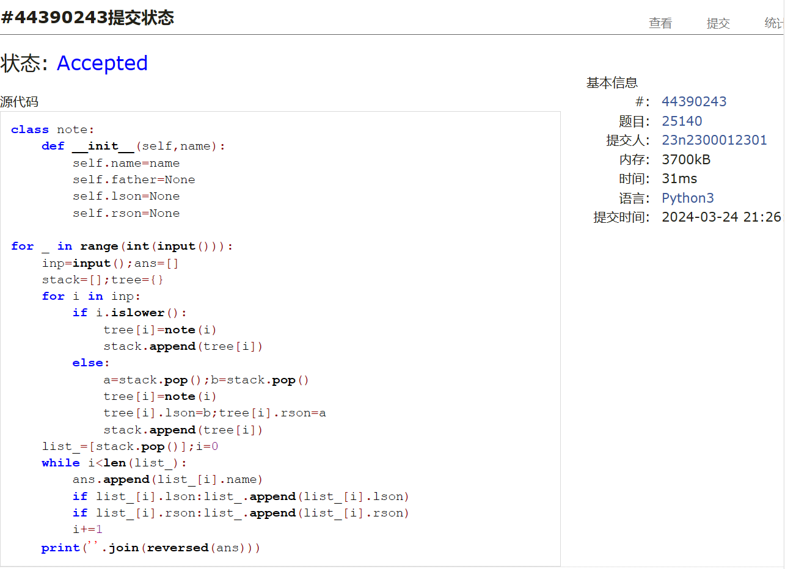

# Assignment #5: "树"算：概念、表示、解析、遍历

Updated 2124 GMT+8 March 17, 2024

2024 spring, Complied by ==周百川，生命科学学院==


**说明：**

1）The complete process to learn DSA from scratch can be broken into 4 parts:

Learn about Time complexities, learn the basics of individual Data Structures, learn the basics of Algorithms, and practice Problems.

2）请把每个题目解题思路（可选），源码Python, 或者C++（已经在Codeforces/Openjudge上AC），截图（包含Accepted），填写到下面作业模版中（推荐使用 typora https://typoraio.cn ，或者用word）。AC 或者没有AC，都请标上每个题目大致花费时间。

3）提交时候先提交pdf文件，再把md或者doc文件上传到右侧“作业评论”。Canvas需要有同学清晰头像、提交文件有pdf、"作业评论"区有上传的md或者doc附件。

4）如果不能在截止前提交作业，请写明原因。


**编程环境**

==（请改为同学的操作系统、编程环境等）==

操作系统：windows 11

Python编程环境：PyCharm 2023.1.4 (Community Edition)

C/C++编程环境：Visual Studio 2022


## 1. 题目

### 27638: 求二叉树的高度和叶子数目

http://cs101.openjudge.cn/practice/27638/


思路：

在之前的树的遍历代码上稍加修改即可。

代码

```python
leaf=0
class note:
    def __init__(self):
        self.father=None
        self.son_left=None
        self.son_right=None
def dfs(t,tree,depth):
    global max_depth,leaf
    if t == None:
        if depth-1>max_depth:max_depth=depth-1
        return
    if t.son_left == t.son_right == None: leaf += 1
    dfs(t.son_left,tree,depth+1)
    dfs(t.son_right,tree,depth+1)


n=int(input());max_depth=0;leaf=0
tree=[note() for _ in range(n)]
for i in tree:
    l,r=map(int,input().split())
    if l == -1:i.son_left=None
    else:i.son_left=tree[l];tree[l].father=i
    if r == -1:i.son_right=None
    else:i.son_right=tree[r];tree[r].father=i
for i in range(n):
    if tree[i].father == None:break
dfs(tree[i],tree,0)
print(max_depth,leaf)

```


代码运行截图 ==（至少包含有"Accepted"）==


### 24729: 括号嵌套树

http://cs101.openjudge.cn/practice/24729/


思路：

在数据读取上遇到了一些困难，花费了不少时间，最终运用栈相关的知识解决了。遍历部分的函数仍然是之前写过的。

代码

```python
class note:
    def __init__(self,name):
        self.father=None
        self.son=[]
        self.name=name
# def dfs(t,tree,depth):
#     global max_depth,leaf
#     if t == None:
#         if depth-1>max_depth:max_depth=depth-1
#         return
#     if t.son_left == t.son_right == None: leaf += 1
#     dfs(t.son_left,tree,depth+1)
#     dfs(t.son_right,tree,depth+1)

def dfs1(t,tree):
    global count,array1
    array1.append(t.name)
    if len(array1) == count:return
    if t.son == []:return
    for i in t.son:
        dfs1(i,tree)
def dfs2(t,tree):
    global count,array2
    array2.append(t.name)
    if len(array2) == count:return
    if t.son == []:return
    for i in reversed(t.son):
        dfs2(i,tree)
def read(root,other):
    global tree,count
    i=0
    while i <len(other):
        if other[i] in ',)':i+=1;continue
        elif other[i] in tree.keys():
            t = other[i];stack = ''
            tree[root].son.append(tree[t])
            tree[t].father=tree[root]
            count+=1;i+=1
        elif other[i] == '(':
            flag=1
            while True:
                i+=1
                if other[i] == '(':flag+=1
                elif other[i] == ')':flag-=1
                if flag == 0:break
                stack+=other[i]
            read(t,stack)


tree={chr(i+ord('A')):note(chr(i+ord('A'))) for i in range(26)}
count=1;array1=[];array2=[]
l=input()
read(l[0],l[2:-1])
dfs1(tree[l[0]],tree)
dfs2(tree[l[0]],tree)
print(''.join(array1))
print(''.join(reversed(array2)))

```


代码运行截图 ==（至少包含有"Accepted"）==


### 02775: 文件结构“图”

http://cs101.openjudge.cn/practice/02775/


思路：

一开始对题目理解不是很透彻，参考了同学的代码之后理解了。不过在文件名的排序上花了很多时间，挺折磨的。

代码

```python
case=1;flag=1;t=0;dict_={};l=[]
output1=[];output2=[];tab='|     '
while True:
    inp=input()
    if inp == '#':exit()
    elif inp == '*':
        output2.sort()
        print('\n'.join(output1 + output2))
        output1=[];output2=[];case+=1;flag=1;t=0
        dict_={};l=[]
        print()
    else:
        if flag:print(f'DATA SET {case}:\nROOT')
        flag=0
        if inp[0] == 'f':
            if t:dict_[l[-1]][1].append(tab*t+inp)
            else:output2.append(inp)
        elif inp[0] == 'd':
            t+=1;dict_[inp]=[[],[]]
            output1.append(tab*t+inp);l.append(inp)
        elif inp[0] == ']':
            t-=1
            if l:a=l.pop()
            if l:dict_[l[-1]][0].extend(dict_[a][0]+sorted(dict_[a][1]))
            else:output1.extend(dict_[a][0]+sorted(dict_[a][1]))

```


代码运行截图 ==（AC代码截图，至少包含有"Accepted"）==


### 25140: 根据后序表达式建立队列表达式

http://cs101.openjudge.cn/practice/25140/


思路：

根据题目给的提示建树即可，注意要求的'按层遍历'方式类似于bfs而不是常见的dfs。

代码

```python
class note:
    def __init__(self,name):
        self.name=name
        self.father=None
        self.lson=None
        self.rson=None

for _ in range(int(input())):
    inp=input();ans=[]
    stack=[];tree={}
    for i in inp:
        if i.islower():
            tree[i]=note(i)
            stack.append(tree[i])
        else:
            a=stack.pop();b=stack.pop()
            tree[i]=note(i)
            tree[i].lson=b;tree[i].rson=a
            stack.append(tree[i])
    list_=[stack.pop()];i=0
    while i<len(list_):
        ans.append(list_[i].name)
        if list_[i].lson:list_.append(list_[i].lson)
        if list_[i].rson:list_.append(list_[i].rson)
        i+=1
    print(''.join(reversed(ans)))

```


代码运行截图 ==（AC代码截图，至少包含有"Accepted"）==



### 24750: 根据二叉树中后序序列建树

http://cs101.openjudge.cn/practice/24750/


思路：

搞懂了前序、中序和后序的概念之后写递归就很容易了，也再一次体会到了递归的魅力(不要去想之后该做什么，只要知道当前该做什么；剩下交给递归)。

代码

```python
class note:
    def __init__(self,name):
        self.name=name
        self.father=None
        self.lson=None
        self.rson=None
ans=''
def solve(mid,suf,root,flag):
    global tree
    if flag == 'l':tree[root].lson=tree[suf[-1]]
    elif flag == 'r':tree[root].rson=tree[suf[-1]]
    l1=mid[:mid.index(suf[-1])];r1=mid[mid.index(suf[-1])+1:]
    l2=''.join([i for i in suf if i in l1])
    r2=''.join([i for i in suf if i in r1])
    if l1 and l2:solve(l1,l2,suf[-1],'l')
    if r1 and r2:solve(r1,r2,suf[-1],'r')
def dfs(t,length):
    global ans
    if len(ans) == length:return
    ans+=t.name
    if t.lson:dfs(t.lson,length)
    if t.rson:dfs(t.rson,length)

tree={chr(ord('A')+i):note(chr(ord('A')+i)) for i in range(26)}
mid=input();suf=input();ans=''
solve(mid,suf,suf[-1],None)
dfs(tree[suf[-1]],len(suf))
print(ans)

```


代码运行截图 ==（AC代码截图，至少包含有"Accepted"）==


### 22158: 根据二叉树前中序序列建树

http://cs101.openjudge.cn/practice/22158/


思路：

跟上一题是同一个模板，可以发现只对代码进行了一点微小的调整。注意到有关树的遍历部分的函数是一直在复用的，这也体现了数算课程中“对象”与“接口”的思想。

代码

```python
class note:
    def __init__(self,name):
        self.name=name
        self.father=None
        self.lson=None
        self.rson=None
ans=''
def solve(mid,pre,root,flag):
    global tree
    if flag == 'l':tree[root].lson=tree[pre[0]]
    elif flag == 'r':tree[root].rson=tree[pre[0]]
    l1=mid[:mid.index(pre[0])];r1=mid[mid.index(pre[0])+1:]
    l2=''.join([i for i in pre if i in l1])
    r2=''.join([i for i in pre if i in r1])
    if l1 and l2:solve(l1,l2,pre[0],'l')
    if r1 and r2:solve(r1,r2,pre[0],'r')
def dfs(t,length):
    global ans
    if len(ans) == length:return
    if t.lson:dfs(t.lson,length)
    if t.rson:dfs(t.rson,length)
    ans+=t.name


while True:
    try:
        tree={chr(ord('A')+i):note(chr(ord('A')+i)) for i in range(26)}
        pre=input();mid=input();ans=''
        solve(mid,pre,pre[0],None)
        dfs(tree[pre[0]],len(pre))
        print(ans)
    except:exit()

```


代码运行截图 ==（AC代码截图，至少包含有"Accepted"）==


## 2. 学习总结和收获

==如果作业题目简单，有否额外练习题目，比如：OJ“2024spring每日选做”、CF、LeetCode、洛谷等网站题目。==

本周作业有一定难度，但只要理清基本概念也并不是难以下手。目前对树、栈与队列的一些基本操作已经有了一定程度的掌握，后续在做大作业的过程中也会对高频复用的代码做一些整理。


