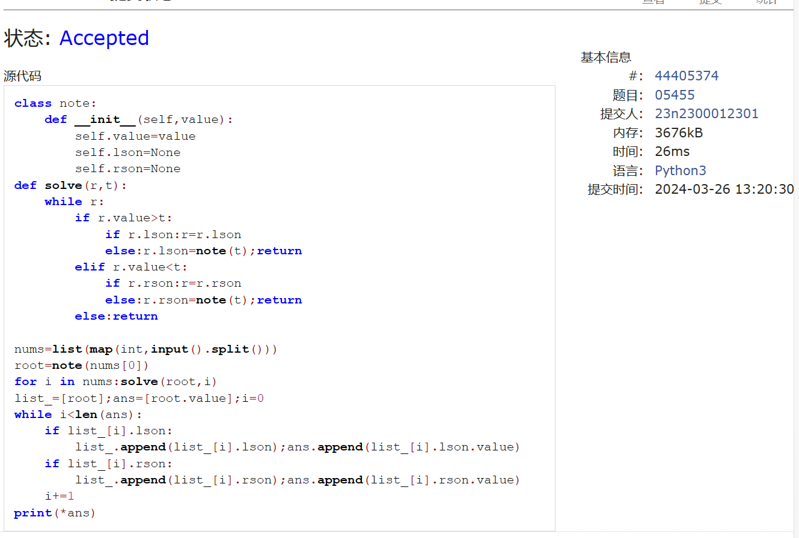
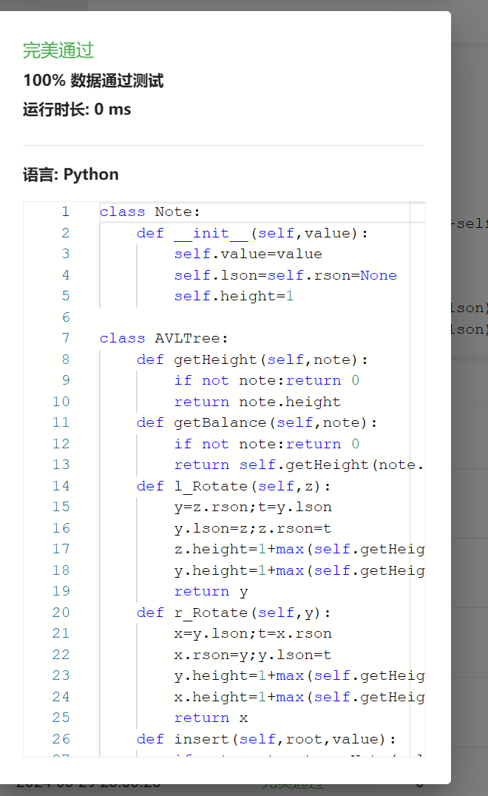

# Assignment #6: "树"算：Huffman,BinHeap,BST,AVL,DisjointSet

Updated 2214 GMT+8 March 24, 2024

2024 spring, Complied by ==周百川，生命科学学院==


**说明：**

1）这次作业内容不简单，耗时长的话直接参考题解。

2）请把每个题目解题思路（可选），源码Python, 或者C++（已经在Codeforces/Openjudge上AC），截图（包含Accepted），填写到下面作业模版中（推荐使用 typora https://typoraio.cn ，或者用word）。AC 或者没有AC，都请标上每个题目大致花费时间。

3）提交时候先提交pdf文件，再把md或者doc文件上传到右侧“作业评论”。Canvas需要有同学清晰头像、提交文件有pdf、"作业评论"区有上传的md或者doc附件。

4）如果不能在截止前提交作业，请写明原因。


**编程环境**

==（请改为同学的操作系统、编程环境等）==

操作系统：windows 11

Python编程环境：PyCharm 2023.1.4 (Community Edition)

C/C++编程环境：Visual Studio 2022 


## 1. 题目

### 22275: 二叉搜索树的遍历

http://cs101.openjudge.cn/practice/22275/


思路：

了解二叉搜索树与一般二叉树的区别之后在正确的代码上稍作调整即可。

代码

```python
class note:
    def __init__(self,value):
        self.value=value
        self.lson=None
        self.rson=None
ans=[]
def solve(root,pre,flag):
    global tree
    if flag == 'l':tree[root].lson=tree[pre[0]]
    elif flag == 'r':tree[root].rson=tree[pre[0]]
    l=[i for i in pre if i<pre[0]]
    r=[i for i in pre if i>pre[0]]
    if l:solve(pre[0],l,'l')
    if r:solve(pre[0],r,'r')
def dfs(t,n):
    global ans
    if len(ans) == n:return
    if t.lson:dfs(t.lson,n)
    if t.rson:dfs(t.rson,n)
    ans.append(t.value)

n=int(input())
tree={i+1:note(i+1) for i in range(n)}
pre=list(map(int,input().split()))
solve(None,pre,None)
dfs(tree[pre[0]],n)
print(*ans)

```


代码运行截图 ==（至少包含有"Accepted"）==


### 05455: 二叉搜索树的层次遍历

http://cs101.openjudge.cn/practice/05455/


思路：

同上，dfs换成bfs就行了。

代码

```python
class note:
    def __init__(self,value):
        self.value=value
        self.lson=None
        self.rson=None
def solve(r,t):
    while r:
        if r.value>t:
            if r.lson:r=r.lson
            else:r.lson=note(t);return
        elif r.value<t:
            if r.rson:r=r.rson
            else:r.rson=note(t);return
        else:return

nums=list(map(int,input().split()))
root=note(nums[0])
for i in nums:solve(root,i)
list_=[root];ans=[root.value];i=0
while i<len(ans):
    if list_[i].lson:
        list_.append(list_[i].lson);ans.append(list_[i].lson.value)
    if list_[i].rson:
        list_.append(list_[i].rson);ans.append(list_[i].rson.value)
    i+=1
print(*ans)

```


代码运行截图 ==（至少包含有"Accepted"）==



### 04078: 实现堆结构

http://cs101.openjudge.cn/practice/04078/

练习自己写个BinHeap。当然机考时候，如果遇到这样题目，直接import heapq。手搓栈、队列、堆、AVL等，考试前需要搓个遍。


思路：

这个题花了点时间，主要在弄懂思路之后的代码实现上。与一般在节点类中写明父子节点的写法不同，使用了完全二叉树的索引关系来找父子节点。

最后也是封装了一个比较完整的类，之后会放进大作业里。

代码

```python
inf=99999999999999999999999999999
class note:
    def __init__(self,value):
        self.value=value
        # self.father=None
        # self.lson=None
        # self.rson=None       #完全二叉树可以通过序号寻找父子节点
    def __lt__(self, other):
        return self.value<other.value
    def __le__(self, other):
        return self.value<=other.value

class BinHeap:
    def __init__(self):
        self.notes=[0]
        self.length=0
    def swap(self,i,j):
        self.notes[i],self.notes[j]=self.notes[j],self.notes[i]
    def shiftdown(self,index):
        t=self.notes[index]
        a=self.notes[index*2] if self.length>=index*2 else note(inf)
        b=self.notes[index*2+1] if self.length>=index*2+1 else note(inf)
        if a<=b and a<t:
            self.swap(index,index*2);self.shiftdown(index*2)
        elif b<=a and b<t:
            self.swap(index,index*2+1);self.shiftdown(index*2+1)
        else:return
    def shiftup(self,index):
        if index == 1:return
        t=self.notes[index]
        if t<self.notes[index//2]:
            self.swap(index,index//2);self.shiftup(index//2)
        else:return
    def pop(self):
        mini=self.notes[1].value
        t=self.notes.pop();self.length-=1
        if self.length:
            self.notes[1]=t;self.shiftdown(1)
        return mini
    def append(self,num):
        self.notes.append(note(num))
        self.length+=1;self.shiftup(self.length)

heap=BinHeap()
for _ in range(int(input())):
    inp=input()
    if inp[0] == '1':heap.append(int(inp[2:]))
    else:print(heap.pop())

```


代码运行截图 ==（AC代码截图，至少包含有"Accepted"）==


### 22161: 哈夫曼编码树

http://cs101.openjudge.cn/practice/22161/


思路：

和上一题写起来的感觉差不多，有了思路之后具体的函数实现还是挺费工夫的。

代码

```python
class Note:
    def __init__(self,stri,freq):
        self.stri=stri;self.freq=freq
        self.father=self.lson=self.rson=None
    def __lt__(self, other):
        if self.freq!=other.freq:return self.freq<other.freq
        else:return self.stri<other.stri
class HuffmanTree:
    def __init__(self,notes):
        self.tree=[Note([note[0]],int(note[1])) for note in notes]
        while len(self.tree) >1:self.integrate()
        self.dict = {};self.dfs(self.tree[0], '')
    def integrate(self):
        self.tree.sort()
        a=self.tree.pop(0);b=self.tree.pop(0)
        c=Note(sorted(a.stri+b.stri),a.freq+b.freq)
        a.father=b.father=c;c.lson=a;c.rson=b
        self.tree.append(c)
    def dfs(self,t,path):
        if len(t.stri) == 1:
            self.dict[t.stri[0]]=path;return
        if t.lson:self.dfs(t.lson,path+'0')
        if t.rson:self.dfs(t.rson,path+'1')
    def raw_to_code(self,raw):
        return ''.join([self.dict[i] for i in raw])
    def code_to_raw(self,code):
        raw='';i=0;t=self.tree[0]
        while i<len(code):
            if code[i] == '0':
                t=t.lson;i+=1
            elif code[i] == '1':
                t=t.rson;i+=1
            if len(t.stri) == 1:
                raw+=t.stri[0];t=self.tree[0]
        return raw

l=[list(input().split()) for _ in range(int(input()))]
HT=HuffmanTree(l)
#print(HT.dict)
try:
    while True:
        inp=input()
        if inp[0].isalpha():print(HT.raw_to_code(inp))
        else:print(HT.code_to_raw(inp))
except:exit()

```


代码运行截图 ==（AC代码截图，至少包含有"Accepted"）==


### 晴问9.5: 平衡二叉树的建立

https://sunnywhy.com/sfbj/9/5/359


思路：

对着gpt的代码做了一点微小的修改，目前还在努力理解中。

代码

```python
class Note:
    def __init__(self,value):
        self.value=value
        self.lson=self.rson=None
        self.height=1

class AVLTree:
    def getHeight(self,note):
        if not note:return 0
        return note.height
    def getBalance(self,note):
        if not note:return 0
        return self.getHeight(note.lson)-self.getHeight(note.rson)
    def l_Rotate(self,z):
        y=z.rson;t=y.lson
        y.lson=z;z.rson=t
        z.height=1+max(self.getHeight(z.lson),self.getHeight(z.rson))
        y.height=1+max(self.getHeight(y.lson),self.getHeight(y.rson))
        return y
    def r_Rotate(self,y):
        x=y.lson;t=x.rson
        x.rson=y;y.lson=t
        y.height=1+max(self.getHeight(y.lson),self.getHeight(y.rson))
        x.height=1+max(self.getHeight(x.lson),self.getHeight(x.rson))
        return x
    def insert(self,root,value):
        if not root:return Note(value)
        elif value<root.value:root.lson=self.insert(root.lson,value)
        else:root.rson=self.insert(root.rson,value)
        root.height=1+max(self.getHeight(root.lson),self.getHeight(root.rson))
        balance=self.getBalance(root)
        if balance > 1 and value < root.lson.value:
                return self.r_Rotate(root)
        if balance < -1 and value > root.rson.value:
                return self.l_Rotate(root)
        if balance > 1 and value > root.lson.value:
                root.lson=self.l_Rotate(root.lson)
                return self.r_Rotate(root)
        if balance < -1 and value < root.rson.value:
                root.rson=self.r_Rotate(root.rson)
                return self.l_Rotate(root)
        return root
    def dfs(self,root):
        if not root:
            return []
        return [root.value]+self.dfs(root.lson)+self.dfs(root.rson)


n=int(input())
nums=list(map(int,input().split()))
tree=AVLTree();root=None
for i in nums:root=tree.insert(root,i)
print(*tree.dfs(root))

```


代码运行截图 ==（AC代码截图，至少包含有"Accepted"）==



### 02524: 宗教信仰

http://cs101.openjudge.cn/practice/02524/


思路：

也是参考了一本算法书上的代码，大致理解了并查集的思路，运用方面可能还需要多找点题目做做。

代码

```python
def find(i,j):
    if j[i] == i:return i
    else:j[i]=find(j[i],j);return j[i]
def merge(i,j,k):
    a=find(i,k);b=find(j,k)
    if a != b:k[a]=b

case=0
while True:
    n,m=map(int,input().split())
    ans=0
    if n==m==0:exit()
    case+=1
    list_=[i for i in range(n+1)]
    for _ in range(m):
        a,b=map(int,input().split())
        merge(a,b,list_)
    for i in range(1,n+1):
        if list_[i] == i:ans+=1
    print(f'Case {case}: {ans}')

```


代码运行截图 ==（AC代码截图，至少包含有"Accepted"）==


## 2. 学习总结和收获

==如果作业题目简单，有否额外练习题目，比如：OJ“2024spring每日选做”、CF、LeetCode、洛谷等网站题目。==

本次作业在上周作业关于树的基础上练习了实际应用中更常出现的几种特殊的树，基本的函数框架还是由一般的树继承而来，但每种树又有各自的特性。
这些树的代码模板基本都手搓了一遍，不过距离熟练运用还有一段距离。之后也会找一些相关的资料深入了解一下这些数据结构的设计思路。


