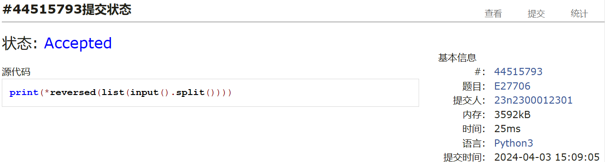
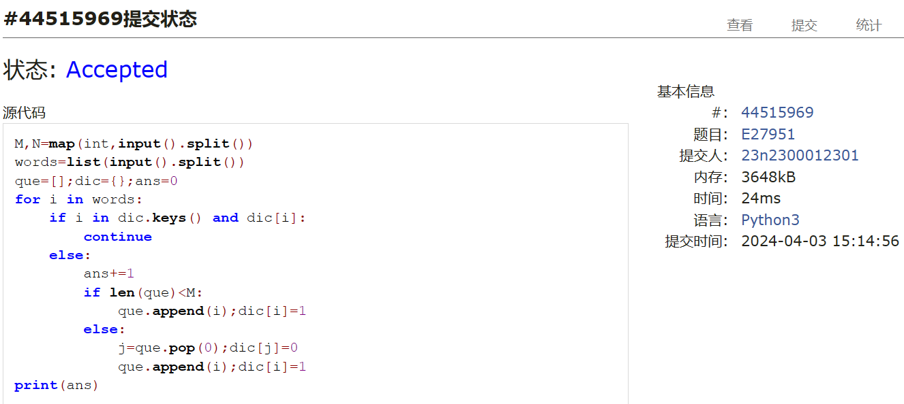
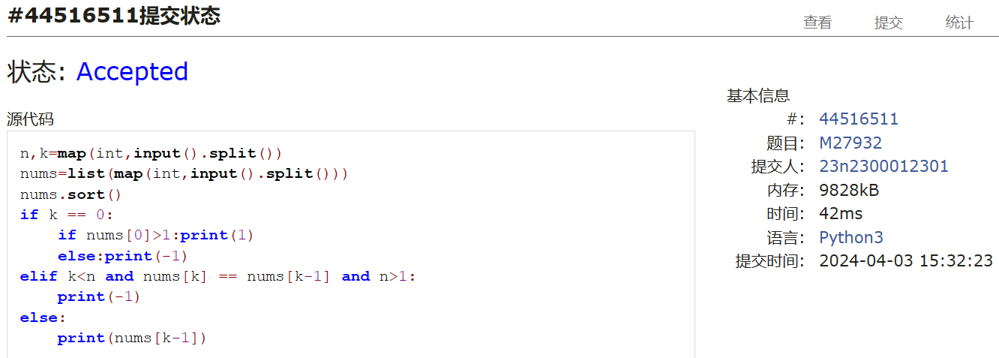
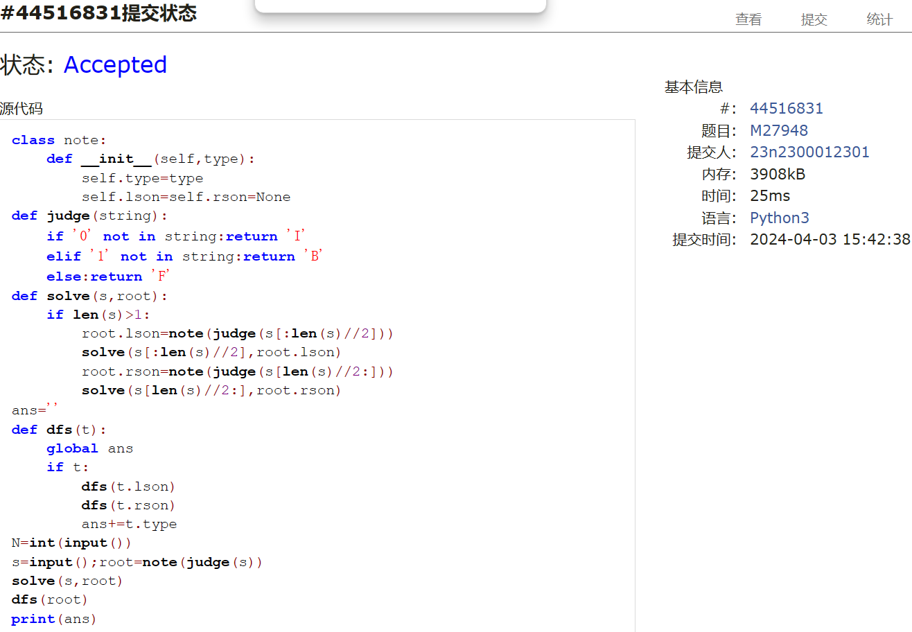
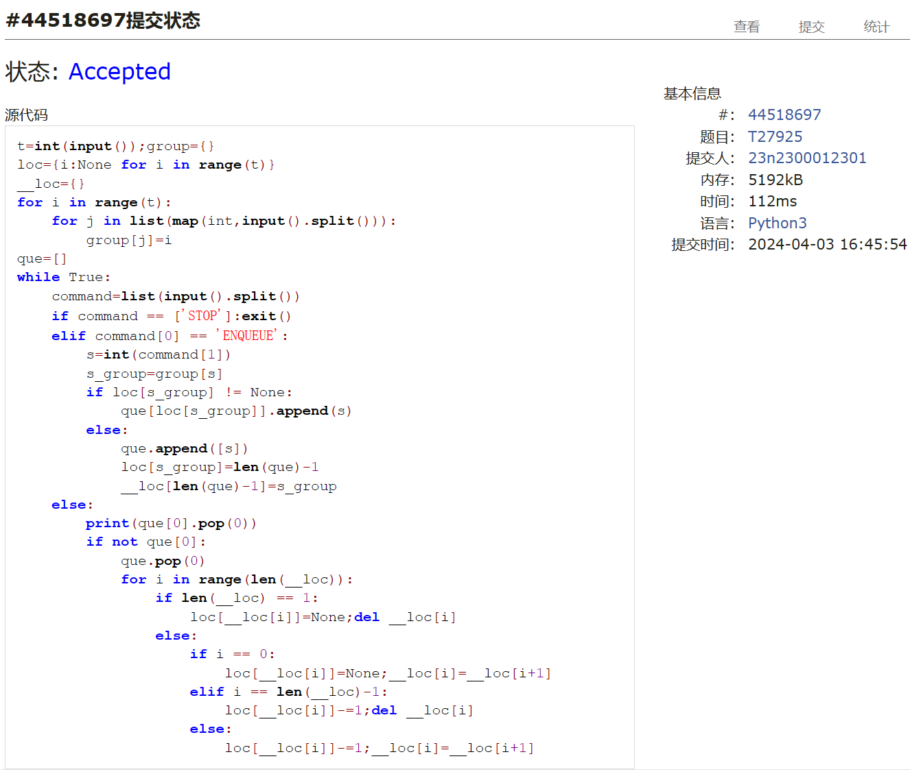
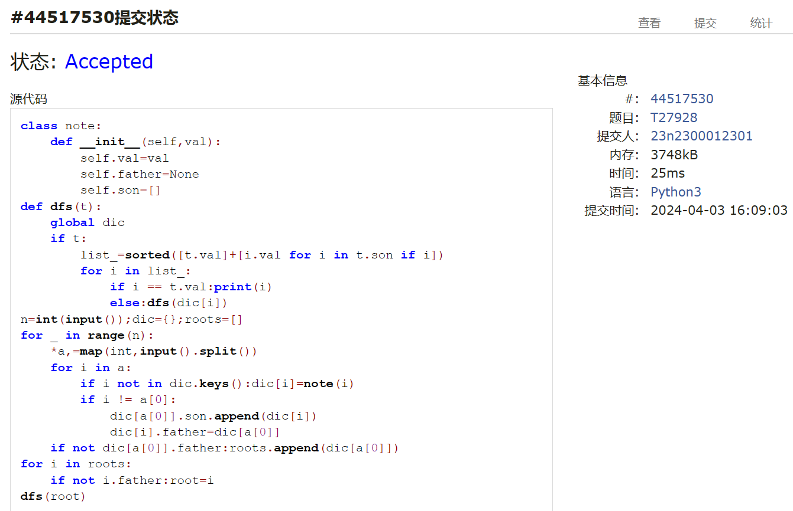

# Assignment #7: April 月考

Updated 1557 GMT+8 Apr 3, 2024

2024 spring, Complied by ==周百川，生命科学学院==


**说明：**

1）请把每个题目解题思路（可选），源码Python, 或者C++（已经在Codeforces/Openjudge上AC），截图（包含Accepted），填写到下面作业模版中（推荐使用 typora https://typoraio.cn ，或者用word）。AC 或者没有AC，都请标上每个题目大致花费时间。

2）提交时候先提交pdf文件，再把md或者doc文件上传到右侧“作业评论”。Canvas需要有同学清晰头像、提交文件有pdf、"作业评论"区有上传的md或者doc附件。

3）如果不能在截止前提交作业，请写明原因。


**编程环境**

==（请改为同学的操作系统、编程环境等）==

操作系统：Windows 11

Python编程环境：PyCharm 2023.1.4 (Community Edition)

C/C++编程环境：Visual Studio 2022


## 1. 题目

### 27706: 逐词倒放

http://cs101.openjudge.cn/practice/27706/


思路：

好像不需要什么思路(

代码

```python
print(*reversed(list(input().split())))

```


代码运行截图 ==（至少包含有"Accepted"）==



### 27951: 机器翻译

http://cs101.openjudge.cn/practice/27951/


思路：

用一下队列即可。

代码

```python
M,N=map(int,input().split())
words=list(input().split())
que=[];dic={};ans=0
for i in words:
    if i in dic.keys() and dic[i]:
        continue
    else:
        ans+=1
        if len(que)<M:
            que.append(i);dic[i]=1
        else:
            j=que.pop(0);dic[j]=0
            que.append(i);dic[i]=1
print(ans)

```


代码运行截图 ==（至少包含有"Accepted"）==



### 27932: Less or Equal

http://cs101.openjudge.cn/practice/27932/


思路：

这题特殊情况有点麻烦，考试的时候卡了挺久的。正常的情况倒是不难做，排个序即可。

代码

```python
n,k=map(int,input().split())
nums=list(map(int,input().split()))
nums.sort()
if k == 0:
    if nums[0]>1:print(1)
    else:print(-1)
elif k<n and nums[k] == nums[k-1] and n>1:
    print(-1) 
else:
    print(nums[k-1])

```


代码运行截图 ==（AC代码截图，至少包含有"Accepted"）==



### 27948: FBI树

http://cs101.openjudge.cn/practice/27948/


思路：

直接递归就行了。

代码

```python
class note:
    def __init__(self,type):
        self.type=type
        self.lson=self.rson=None
def judge(string):
    if '0' not in string:return 'I'
    elif '1' not in string:return 'B'
    else:return 'F'
def solve(s,root):
    if len(s)>1:
        root.lson=note(judge(s[:len(s)//2]))
        solve(s[:len(s)//2],root.lson)
        root.rson=note(judge(s[len(s)//2:]))
        solve(s[len(s)//2:],root.rson)
ans=''
def dfs(t):
    global ans
    if t:
        dfs(t.lson)
        dfs(t.rson)
        ans+=t.type
N=int(input())
s=input();root=note(judge(s))
solve(s,root)
dfs(root)
print(ans)

```


代码运行截图 ==（AC代码截图，至少包含有"Accepted"）==



### 27925: 小组队列

http://cs101.openjudge.cn/practice/27925/


思路：

刚看到这题觉得有点难，就放到最后一题做了。最后是用了列表套列表来模拟队列，并用多个字典来储存各个小组在队列中的位置。

代码

```python
t=int(input());group={}
loc={i:None for i in range(t)}
__loc={}
for i in range(t):
    for j in list(map(int,input().split())):
        group[j]=i
que=[]
while True:
    command=list(input().split())
    if command == ['STOP']:exit()
    elif command[0] == 'ENQUEUE':
        s=int(command[1])
        s_group=group[s]
        if loc[s_group] != None:
            que[loc[s_group]].append(s)
        else:
            que.append([s])
            loc[s_group]=len(que)-1
            __loc[len(que)-1]=s_group
    else:
        print(que[0].pop(0))
        if not que[0]:
            que.pop(0)
            for i in range(len(__loc)):
                if len(__loc) == 1:
                    loc[__loc[i]]=None;del __loc[i]
                else:
                    if i == 0:
                        loc[__loc[i]]=None;__loc[i]=__loc[i+1]
                    elif i == len(__loc)-1:
                        loc[__loc[i]]-=1;del __loc[i]
                    else:
                        loc[__loc[i]]-=1;__loc[i]=__loc[i+1]

```


代码运行截图 ==（AC代码截图，至少包含有"Accepted"）==



### 27928: 遍历树

http://cs101.openjudge.cn/practice/27928/


思路：

找根节点花了点时间，剩下就正常遍历即可。

代码

```python
class note:
    def __init__(self,val):
        self.val=val
        self.father=None
        self.son=[]
def dfs(t):
    global dic
    if t:
        list_=sorted([t.val]+[i.val for i in t.son if i])
        for i in list_:
            if i == t.val:print(i)
            else:dfs(dic[i])
n=int(input());dic={};roots=[]
for _ in range(n):
    *a,=map(int,input().split())
    for i in a:
        if i not in dic.keys():dic[i]=note(i)
        if i != a[0]:
            dic[a[0]].son.append(dic[i])
            dic[i].father=dic[a[0]]
    if not dic[a[0]].father:roots.append(dic[a[0]])
for i in roots:
    if not i.father:root=i
dfs(root)

```


代码运行截图 ==（AC代码截图，至少包含有"Accepted"）==



## 2. 学习总结和收获

==如果作业题目简单，有否额外练习题目，比如：OJ“2024spring每日选做”、CF、LeetCode、洛谷等网站题目。==

考试大概一小时四十分钟AC6，感觉数算课程很多时候思维的难度是比不上计概的，很多题目都是套模板。
不过笔试还是有点吃力。之后会做一些基础概念方面的学习，并加大一些做题量。


