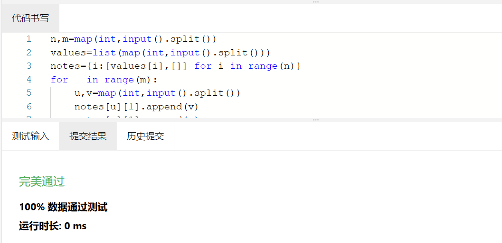

# Assignment #8: 图论：概念、遍历，及 树算

Updated 1919 GMT+8 Apr 8, 2024

2024 spring, Complied by =周百川，生命科学学院==


**说明：**

1）请把每个题目解题思路（可选），源码Python, 或者C++（已经在Codeforces/Openjudge上AC），截图（包含Accepted），填写到下面作业模版中（推荐使用 typora https://typoraio.cn ，或者用word）。AC 或者没有AC，都请标上每个题目大致花费时间。

2）提交时候先提交pdf文件，再把md或者doc文件上传到右侧“作业评论”。Canvas需要有同学清晰头像、提交文件有pdf、"作业评论"区有上传的md或者doc附件。

3）如果不能在截止前提交作业，请写明原因。


**编程环境**

==（请改为同学的操作系统、编程环境等）==

操作系统：Windows 11

Python编程环境：SPyCharm 2023.1.4 (Community Edition)

C/C++编程环境：Visual Studio 2022


## 1. 题目

### 19943: 图的拉普拉斯矩阵

matrices, http://cs101.openjudge.cn/practice/19943/

请定义Vertex类，Graph类，然后实现


思路：


代码

```python
class graph:
    def __init__(self,n):
        self.size=n
        self.D=[[0]*n for _ in range(n)]
        self.A=[[0]*n for _ in range(n)]
    def read(self,a,b):
        self.D[a][a]+=1;self.D[b][b]+=1
        self.A[a][b]=self.A[b][a]=1
    def L(self):
        for i in range(self.size):
            print(*[self.D[i][j]-self.A[i][j] for j in range(self.size)])

n,m=map(int,input().split())
Graph=graph(n)
for _ in range(m):
    Graph.read(*map(int,input().split()))
Graph.L()

```


代码运行截图 ==（至少包含有"Accepted"）==


### 18160: 最大连通域面积

matrix/dfs similar, http://cs101.openjudge.cn/practice/18160


思路：


代码

```python
n=m=0
def dfs(x,y,x0,y0):
    global n,m,map_,book,ans_map
    next_step=[[0,1],[1,1],[1,0],[1,-1],[0,-1],[-1,-1],[-1,0],[-1,1]]
    for i in range(8):
        tx=x+next_step[i][0];ty=y+next_step[i][1]
        if tx<0 or tx>=n or ty<0 or ty>=m:
            continue
        if map_[tx][ty] == 'W' and book[tx][ty] == 0:
            ans_map[x0][y0]+=1
            book[tx][ty]=1
            dfs(tx,ty,x0,y0)
    return

for __ in range(int(input())):
    n,m=map(int,input().split())
    book=[[0]*m for _ in range(n)]
    ans_map=[[0]*m for _ in range(n)]
    map_=[];ans=[]
    for _ in range(n):
        map_.append(list(input()))
    for p in range(n):
        for q in range(m):
            if map_[p][q] == 'W' and book[p][q] == 0:
                book[p][q]=ans_map[p][q]=1
                dfs(p,q,p,q)
    for t in ans_map:
        ans.append(max(t))
    print(max(ans))
```


代码运行截图 ==（至少包含有"Accepted"）==


### sy383: 最大权值连通块

https://sunnywhy.com/sfbj/10/3/383


思路：


代码

```python
n,m=map(int,input().split())
values=list(map(int,input().split()))
notes={i:[values[i],[]] for i in range(n)}
for _ in range(m):
    u,v=map(int,input().split())
    notes[u][1].append(v)
    notes[v][1].append(u)
book1=[0]*n;book2=[];ans_=[];ans=0
def dfs(t):
    global ans
    ans+=notes[t][0]
    book2.append(t)
    for i in notes[t][1]:
        if book1[i] == 0:
            book1[i]=1
            dfs(i)
    return
for i in range(n):
    if i not in book2:
        ans=0;book1[i]=1
        dfs(i)
        ans_.append(ans)
print(max(ans_))

```


代码运行截图 ==（AC代码截图，至少包含有"Accepted"）==



### 03441: 4 Values whose Sum is 0

data structure/binary search, http://cs101.openjudge.cn/practice/03441


思路：


代码

```python
def fourSumCount(A, B, C, D):
    count = 0
    sum_map = {}

    # 计算A和B的所有可能和，并记录其出现次数
    for a in A:
        for b in B:
            if a + b in sum_map:
                sum_map[a + b] += 1
            else:
                sum_map[a + b] = 1

    # 在C和D中寻找相反数，如果存在则累加计数
    for c in C:
        for d in D:
            if -1 * (c + d) in sum_map:
                count += sum_map[-1 * (c + d)]

    return count

# 读取输入
n = int(input())
A, B, C, D = [], [], [], []
for _ in range(n):
    a, b, c, d = map(int, input().split())
    A.append(a)
    B.append(b)
    C.append(c)
    D.append(d)

# 输出结果
print(fourSumCount(A, B, C, D))

```


代码运行截图 ==（AC代码截图，至少包含有"Accepted"）==


### 04089: 电话号码

trie, http://cs101.openjudge.cn/practice/04089/

Trie 数据结构可能需要自学下。


思路：


代码

```python
class note:
    def __init__(self,val):
        self.val=val
        self.son=[]
class Trie:
    def __init__(self):
        self.root=note('X')
        self.leaves=0
    def add(self,string):
        string='X'+string
        t=self.root;i=1
        while i < len(string):
            flag=0
            if t.son:
                for j in t.son:
                    if j.val == string[i]:
                        t=j;i+=1;flag=1;break
            if not flag:
                t.son.append(s:=note(string[i]))
                t=s;i+=1
    def dfs(self,t):
        if not t.son:self.leaves+=1;return
        for i in t.son:self.dfs(i)
    def count(self):
        self.dfs(self.root)
        return self.leaves

for _ in range(int(input())):
    n=int(input())
    trie=Trie()
    for _ in range(n):
        trie.add(input())
    print('YES' if n == trie.count() else 'NO')


```


代码运行截图 ==（AC代码截图，至少包含有"Accepted"）==


### 04082: 树的镜面映射

http://cs101.openjudge.cn/practice/04082/


思路：


代码

```python
from collections import deque

class TreeNode:
    def __init__(self, x):
        self.x = x
        self.children = []

def create_node():
    return TreeNode('')

def build_tree(tempList, index):
    node = create_node()
    node.x = tempList[index][0]
    if tempList[index][1] == '0':
        index += 1
        child, index = build_tree(tempList, index)
        node.children.append(child)
        index += 1
        child, index = build_tree(tempList, index)
        node.children.append(child)
    return node, index

def print_tree(p):
    Q = deque()
    s = deque()

    # 遍历右子节点并将非虚节点加入栈s
    while p is not None:
        if p.x != '$':
            s.append(p)
        p = p.children[1] if len(p.children) > 1 else None

    # 将栈s中的节点逆序放入队列Q
    while s:
        Q.append(s.pop())

    # 宽度优先遍历队列Q并打印节点值
    while Q:
        p = Q.popleft()
        print(p.x, end=' ')

        # 如果节点有左子节点，将左子节点及其右子节点加入栈s
        if p.children:
            p = p.children[0]
            while p is not None:
                if p.x != '$':
                    s.append(p)
                p = p.children[1] if len(p.children) > 1 else None

            # 将栈s中的节点逆序放入队列Q
            while s:
                Q.append(s.pop())


n = int(input())
tempList = input().split()

# 构建多叉树
root, _ = build_tree(tempList, 0)

# 执行宽度优先遍历并打印镜像映射序列
print_tree(root)

```


代码运行截图 ==（AC代码截图，至少包含有"Accepted"）==


## 2. 学习总结和收获

==如果作业题目简单，有否额外练习题目，比如：OJ“2024spring每日选做”、CF、LeetCode、洛谷等网站题目。==

Laplace矩阵和两题dfs都挺常规的，四数之和o(n^4)肯定过不了写指针又写不明白，最后问gpt整了一个n^2的算法。
Trie树还好，弄懂概念就行；镜面映射没时间写了就看了题解，目前差不多弄懂了概念，但感觉自己实现还是有点困难。

期中考完一半了，稍微闲下来了一点。准备把图相关的概念看一看。


