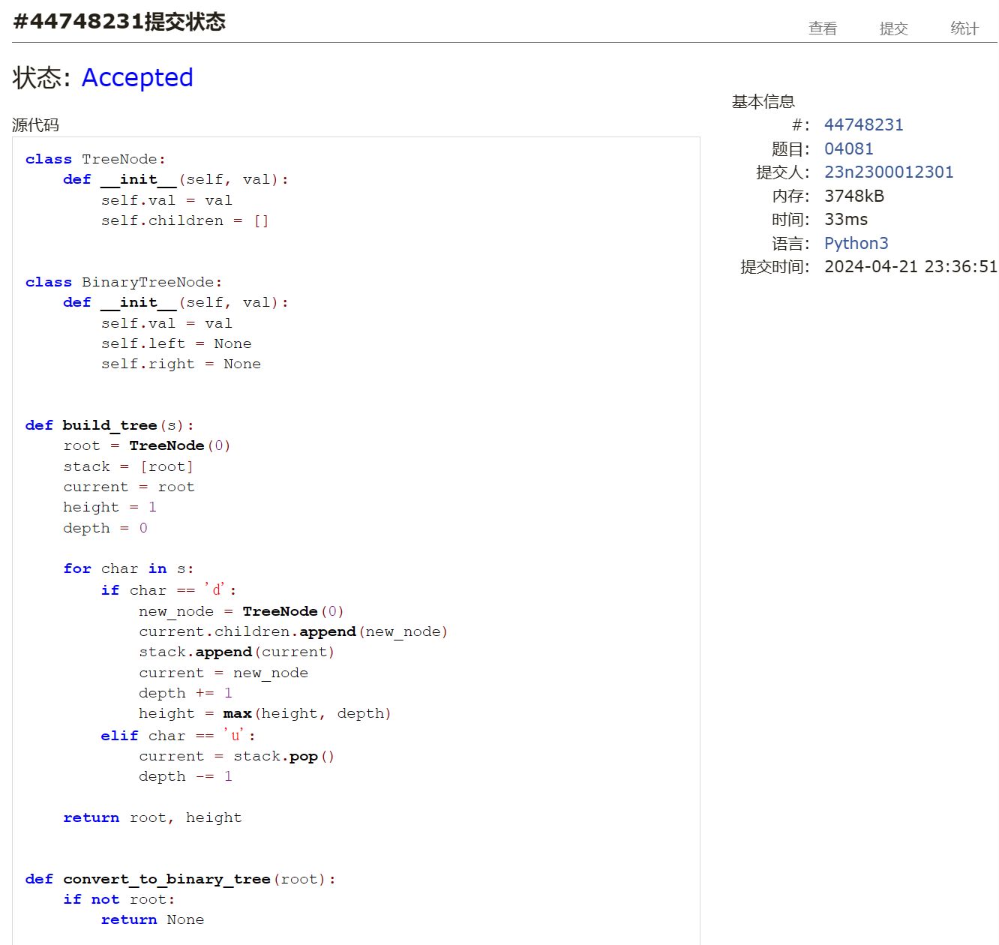
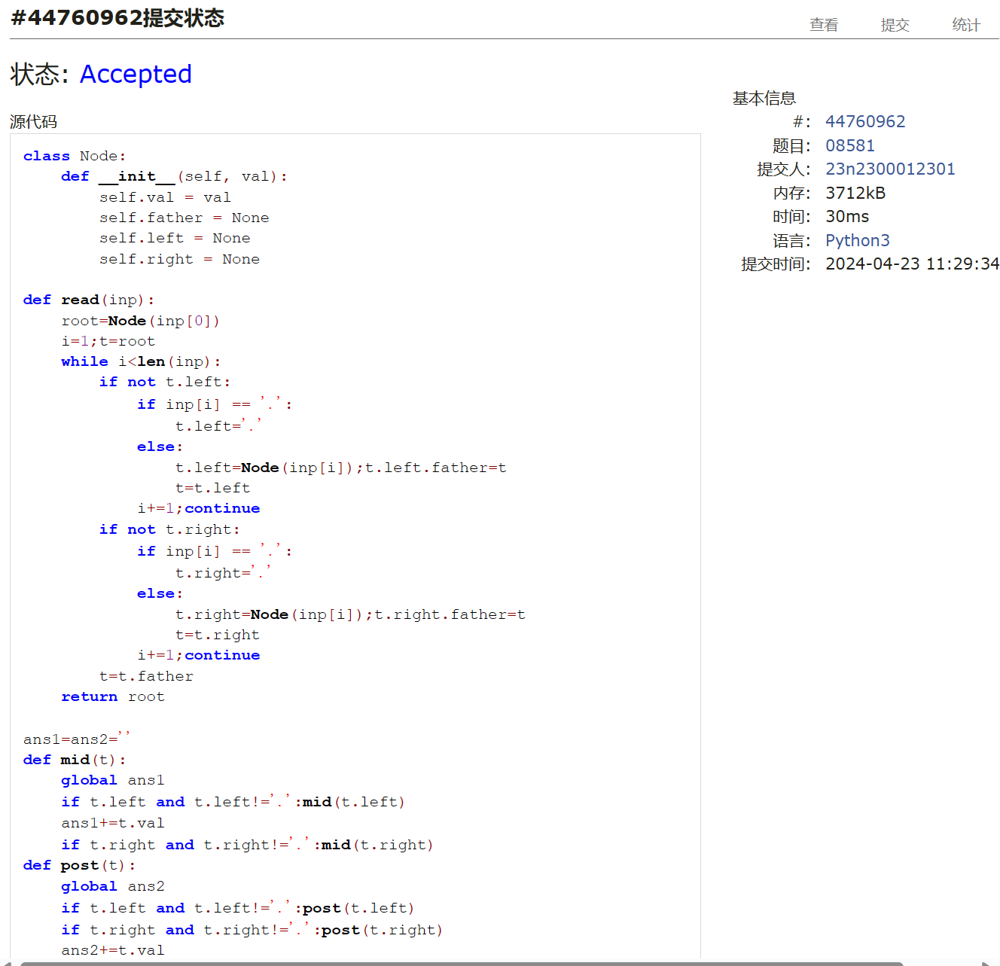
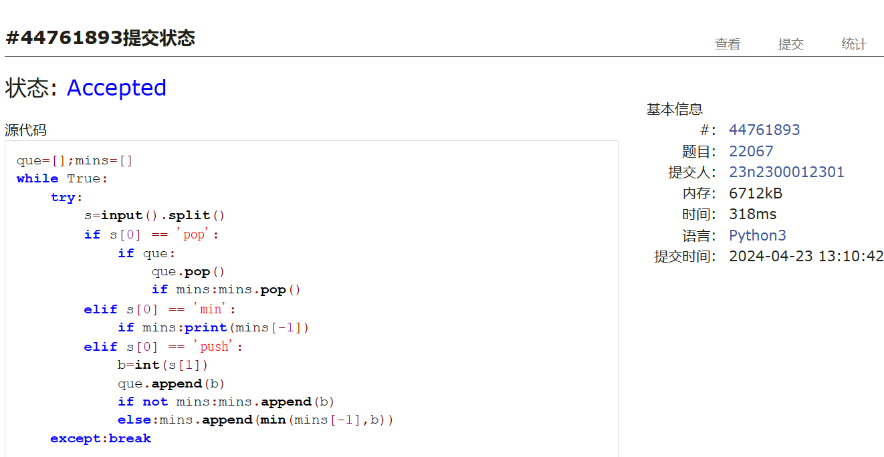
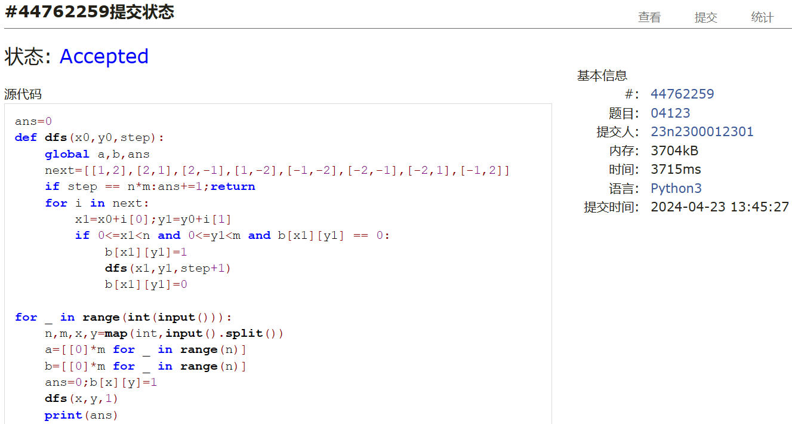
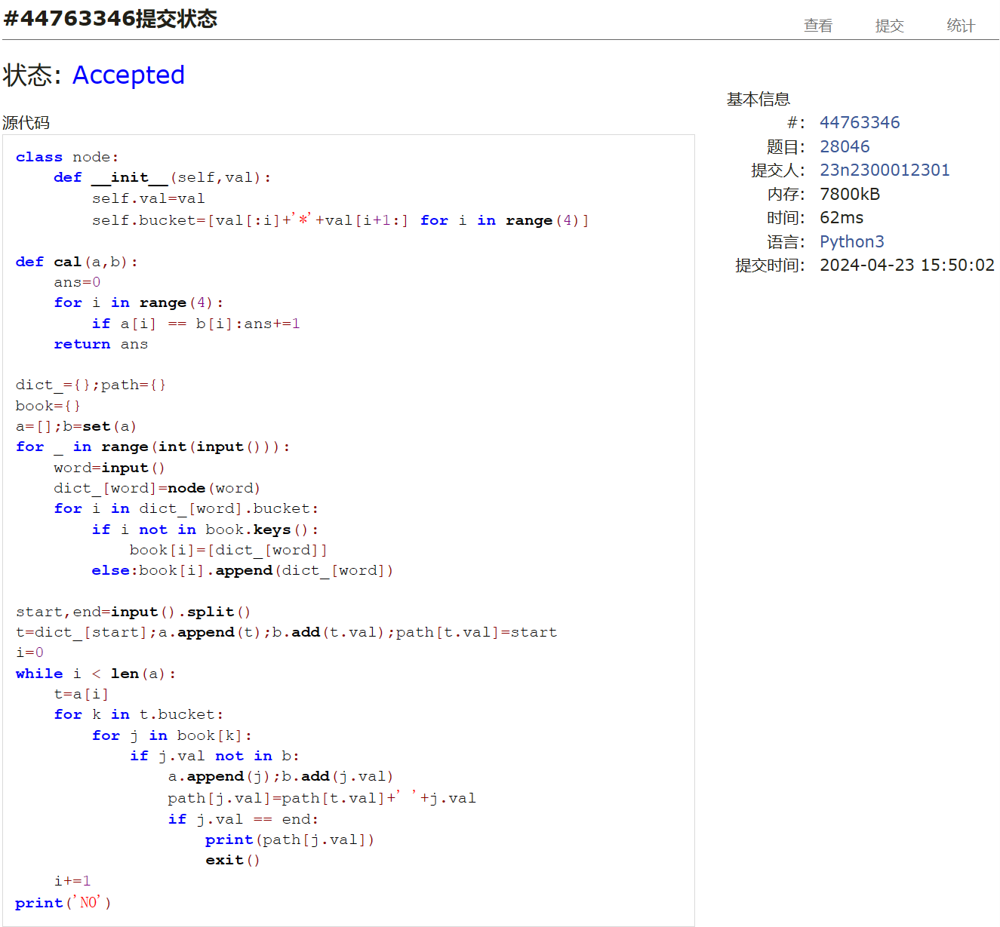
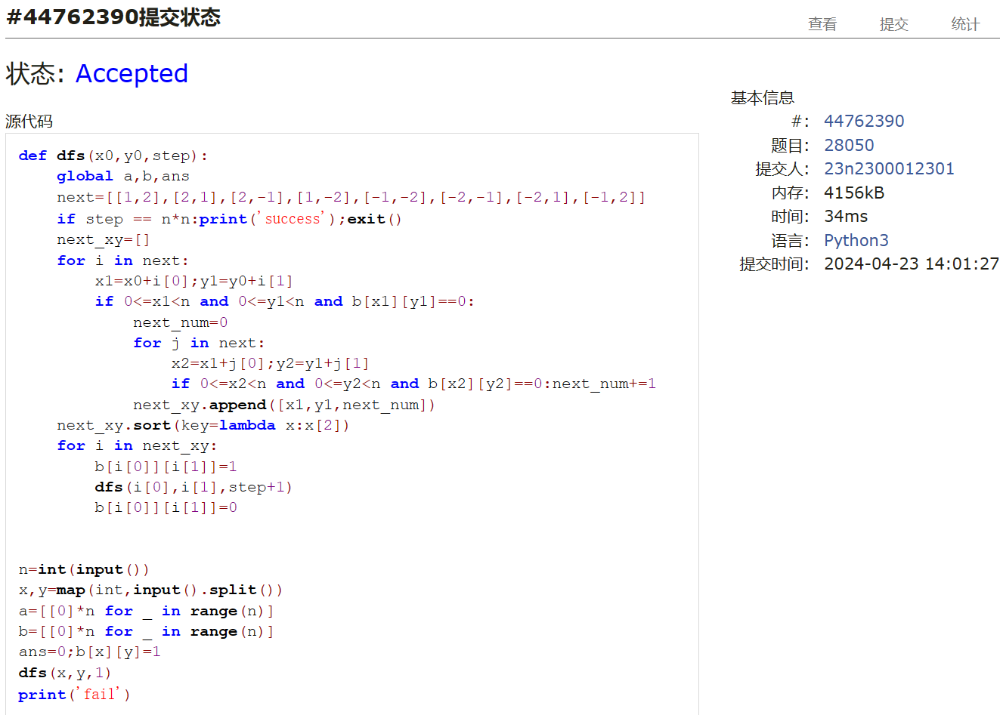

# Assignment #9: 图论：遍历，及 树算

Updated 1739 GMT+8 Apr 14, 2024

2024 spring, Complied by ==周百川，生命科学学院==


**说明：**

1）请把每个题目解题思路（可选），源码Python, 或者C++（已经在Codeforces/Openjudge上AC），截图（包含Accepted），填写到下面作业模版中（推荐使用 typora https://typoraio.cn ，或者用word）。AC 或者没有AC，都请标上每个题目大致花费时间。

2）提交时候先提交pdf文件，再把md或者doc文件上传到右侧“作业评论”。Canvas需要有同学清晰头像、提交文件有pdf、"作业评论"区有上传的md或者doc附件。

3）如果不能在截止前提交作业，请写明原因。


**编程环境**

==（请改为同学的操作系统、编程环境等）==

操作系统：windows 11

Python编程环境：PyCharm 2023.1.4 (Community Edition)

C/C++编程环境：Visual Studio 2022


## 1. 题目

### 04081: 树的转换

http://cs101.openjudge.cn/dsapre/04081/


思路：
 
参考了gpt，虽然代码看着很长但理解思路之后也不难弄懂。

代码

```python
class TreeNode:
    def __init__(self, val):
        self.val = val
        self.children = []


class BinaryTreeNode:
    def __init__(self, val):
        self.val = val
        self.left = None
        self.right = None


def build_tree(s):
    root = TreeNode(0)
    stack = [root]
    current = root
    height = 1
    depth = 0

    for char in s:
        if char == 'd':
            new_node = TreeNode(0)
            current.children.append(new_node)
            stack.append(current)
            current = new_node
            depth += 1
            height = max(height, depth)
        elif char == 'u':
            current = stack.pop()
            depth -= 1

    return root, height


def convert_to_binary_tree(root):
    if not root:
        return None

    binary_root = BinaryTreeNode(root.val)
    queue = [(root, binary_root)]

    while queue:
        node, binary_node = queue.pop(0)

        for child in node.children:
            binary_child = BinaryTreeNode(child.val)
            if not binary_node.left:
                binary_node.left = binary_child
            else:
                current = binary_node.left
                while current.right:
                    current = current.right
                current.right = binary_child
            queue.append((child, binary_child))

    return binary_root


def calculate_depth(root):
    if not root:
        return 0
    return max(calculate_depth(root.left), calculate_depth(root.right)) + 1


def main():
    s = input().strip()
    original_tree, depth_before = build_tree(s)
    binary_tree = convert_to_binary_tree(original_tree)
    depth_after = calculate_depth(binary_tree)

    print(f"{depth_before} => {depth_after-1}")


if __name__ == "__main__":
    main()

```


代码运行截图 ==（至少包含有"Accepted"）==



### 08581: 扩展二叉树

http://cs101.openjudge.cn/dsapre/08581/


思路：

题目不难，注意建树细节然后按题意遍历即可。

代码

```python
class Node:
    def __init__(self, val):
        self.val = val
        self.father = None
        self.left = None
        self.right = None

def read(inp):
    root=Node(inp[0])
    i=1;t=root
    while i<len(inp):
        if not t.left:
            if inp[i] == '.':
                t.left='.'
            else:
                t.left=Node(inp[i]);t.left.father=t
                t=t.left
            i+=1;continue
        if not t.right:
            if inp[i] == '.':
                t.right='.'
            else:
                t.right=Node(inp[i]);t.right.father=t
                t=t.right
            i+=1;continue
        t=t.father
    return root

ans1=ans2=''
def mid(t):
    global ans1
    if t.left and t.left!='.':mid(t.left)
    ans1+=t.val
    if t.right and t.right!='.':mid(t.right)
def post(t):
    global ans2
    if t.left and t.left!='.':post(t.left)
    if t.right and t.right!='.':post(t.right)
    ans2+=t.val

Root=read(input())
mid(Root);post(Root)
print(ans1,ans2,sep='\n')

```


代码运行截图 ==（至少包含有"Accepted"）==



### 22067: 快速堆猪

http://cs101.openjudge.cn/practice/22067/


思路：

自己的方法不知道为什么一直RE，感觉就算不RE也会TLE，于是参考了题解。大致思路差不多，不过在一些细节上有所差别。

代码

```python
que=[];mins=[]
while True:
    try:
        s=input().split()
        if s[0] == 'pop':
            if que:
                que.pop()
                if mins:mins.pop()
        elif s[0] == 'min':
            if mins:print(mins[-1])
        elif s[0] == 'push':
            b=int(s[1])
            que.append(b)
            if not mins:mins.append(b)
            else:mins.append(min(mins[-1],b))
    except:break

```


代码运行截图 ==（AC代码截图，至少包含有"Accepted"）==



### 04123: 马走日

dfs, http://cs101.openjudge.cn/practice/04123


思路：

正常dfs即可。

代码

```python
def dfs(x0,y0,step):
    global a,b,ans
    next=[[1,2],[2,1],[2,-1],[1,-2],[-1,-2],[-2,-1],[-2,1],[-1,2]]
    if step == n*m:ans+=1;return
    for i in next:
        x1=x0+i[0];y1=y0+i[1]
        if 0<=x1<n and 0<=y1<m and b[x1][y1] == 0:
            b[x1][y1]=1
            dfs(x1,y1,step+1)
            b[x1][y1]=0

for _ in range(int(input())):
    n,m,x,y=map(int,input().split())
    a=[[0]*m for _ in range(n)]
    b=[[0]*m for _ in range(n)]
    ans=0;b[x][y]=1
    dfs(x,y,1)
    print(ans)

```


代码运行截图 ==（AC代码截图，至少包含有"Accepted"）==



### 28046: 词梯

bfs, http://cs101.openjudge.cn/practice/28046/


思路：

一开始一直TLE，后来发现不能像树那样维护子节点来判定哪些节点是联通的，需要用桶的方法。其他部分就是正常bfs.

代码

```python
class node:
    def __init__(self,val):
        self.val=val
        self.bucket=[val[:i]+'*'+val[i+1:] for i in range(4)]

def cal(a,b):
    ans=0
    for i in range(4):
        if a[i] == b[i]:ans+=1
    return ans

dict_={};path={}
book={}
a=[];b=set(a)
for _ in range(int(input())):
    word=input()
    dict_[word]=node(word)
    for i in dict_[word].bucket:
        if i not in book.keys():
            book[i]=[dict_[word]]
        else:book[i].append(dict_[word])

start,end=input().split()
t=dict_[start];a.append(t);b.add(t.val);path[t.val]=start
i=0
while i < len(a):
    t=a[i]
    for k in t.bucket:
        for j in book[k]:
            if j.val not in b:
                a.append(j);b.add(j.val)
                path[j.val]=path[t.val]+' '+j.val
                if j.val == end:
                    print(path[j.val])
                    exit()
    i+=1
print('NO')

```


代码运行截图 ==（AC代码截图，至少包含有"Accepted"）==



### 28050: 骑士周游

dfs, http://cs101.openjudge.cn/practice/28050/


思路：

需要大力剪枝的dfs，剪枝所用到的思路需要学习。

代码

```python
def dfs(x0,y0,step):
    global a,b,ans
    next=[[1,2],[2,1],[2,-1],[1,-2],[-1,-2],[-2,-1],[-2,1],[-1,2]]
    if step == n*n:print('success');exit()
    next_xy=[]
    for i in next:
        x1=x0+i[0];y1=y0+i[1]
        if 0<=x1<n and 0<=y1<n and b[x1][y1]==0:
            next_num=0
            for j in next:
                x2=x1+j[0];y2=y1+j[1]
                if 0<=x2<n and 0<=y2<n and b[x2][y2]==0:next_num+=1
            next_xy.append([x1,y1,next_num])
    next_xy.sort(key=lambda x:x[2])
    for i in next_xy:
        b[i[0]][i[1]]=1
        dfs(i[0],i[1],step+1)
        b[i[0]][i[1]]=0
        

n=int(input())
x,y=map(int,input().split())
a=[[0]*n for _ in range(n)]
b=[[0]*n for _ in range(n)]
ans=0;b[x][y]=1
dfs(x,y,1)
print('fail')

```


代码运行截图 ==（AC代码截图，至少包含有"Accepted"）==



## 2. 学习总结和收获

==如果作业题目简单，有否额外练习题目，比如：OJ“2024spring每日选做”、CF、LeetCode、洛谷等网站题目。==

期中周还是太忙了，这种基本只做完了作业的这几道题。之后会补上来。

图的写法还需要进一步熟悉，等五一假期有空会多找些题做做。


