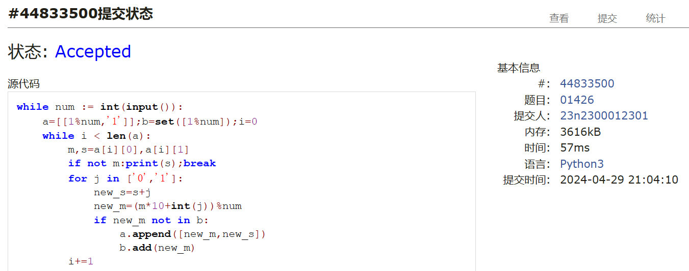
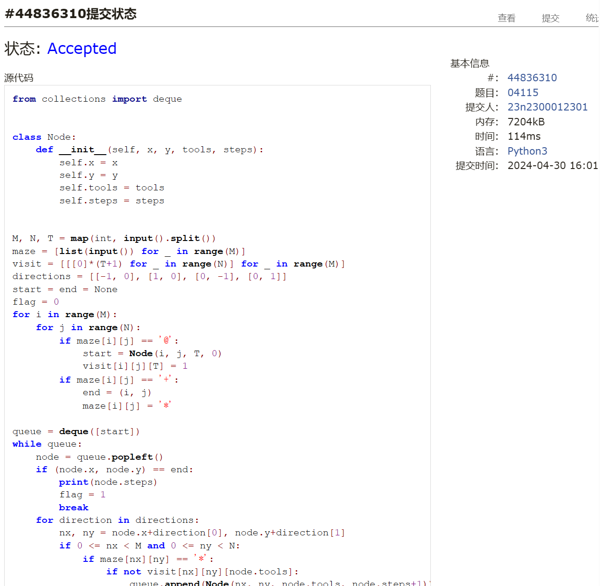
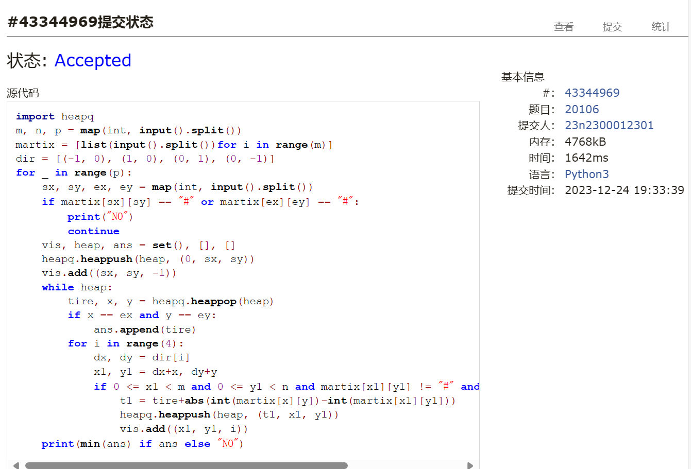
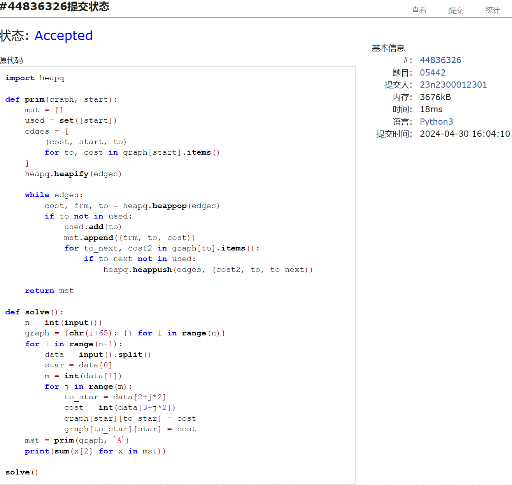

# Assignment #A: 图论：算法，树算及栈

Updated 2018 GMT+8 Apr 21, 2024

2024 spring, Complied by ==周百川，生命科学学院==


**说明：**

1）请把每个题目解题思路（可选），源码Python, 或者C++（已经在Codeforces/Openjudge上AC），截图（包含Accepted），填写到下面作业模版中（推荐使用 typora https://typoraio.cn ，或者用word）。AC 或者没有AC，都请标上每个题目大致花费时间。

2）提交时候先提交pdf文件，再把md或者doc文件上传到右侧“作业评论”。Canvas需要有同学清晰头像、提交文件有pdf、"作业评论"区有上传的md或者doc附件。

3）如果不能在截止前提交作业，请写明原因。


**编程环境**

==（请改为同学的操作系统、编程环境等）==

操作系统：windows 11

Python编程环境：PyCharm 2023.1.4 (Community Edition)

C/C++编程环境：Visual Studio 2022


## 1. 题目

### 20743: 整人的提词本

http://cs101.openjudge.cn/practice/20743/


思路：

写两个栈即可。

代码

```python
stack1=[];stack2=[]
s=input()
for i in s:
    if i  == ')':
        while True:
            j=stack1.pop()
            if j == '(':
                stack1.extend(stack2)
                stack2.clear()
                break
            else:stack2.append(j)
    else:stack1.append(i)
print(''.join(stack1))

```


代码运行截图 ==（至少包含有"Accepted"）==


### 02255: 重建二叉树

http://cs101.openjudge.cn/practice/02255/


思路：

直接复用了之前的代码（

代码

```python
class node:
    def __init__(self,name):
        self.name=name
        self.father=None
        self.lson=None
        self.rson=None
ans=''
def solve(mid,pre,root,flag):
    global tree
    if flag == 'l':tree[root].lson=tree[pre[0]]
    elif flag == 'r':tree[root].rson=tree[pre[0]]
    l1=mid[:mid.index(pre[0])];r1=mid[mid.index(pre[0])+1:]
    l2=''.join([i for i in pre if i in l1])
    r2=''.join([i for i in pre if i in r1])
    if l1 and l2:solve(l1,l2,pre[0],'l')
    if r1 and r2:solve(r1,r2,pre[0],'r')
def dfs(t,length):
    global ans
    if len(ans) == length:return
    if t.lson:dfs(t.lson,length)
    if t.rson:dfs(t.rson,length)
    ans+=t.name


while True:
    try:
        tree={chr(ord('A')+i):node(chr(ord('A') + i)) for i in range(26)}
        pre,mid=input().split();ans=''
        solve(mid,pre,pre[0],None)
        dfs(tree[pre[0]],len(pre))
        print(ans)
    except:exit()

```


代码运行截图 ==（至少包含有"Accepted"）==


### 01426: Find The Multiple

http://cs101.openjudge.cn/practice/01426/

要求用bfs实现


思路：


代码

```python
while num := int(input()):
    a=[[1%num,'1']];b=set([1%num]);i=0
    while i < len(a):
        m,s=a[i][0],a[i][1]
        if not m:print(s);break
        for j in ['0','1']:
            new_s=s+j
            new_m=(m*10+int(j))%num
            if new_m not in b:
                a.append([new_m,new_s])
                b.add(new_m)
        i+=1


```


代码运行截图 ==（AC代码截图，至少包含有"Accepted"）==



### 04115: 鸣人和佐助

bfs, http://cs101.openjudge.cn/practice/04115/


思路：


代码

```python
from collections import deque


class Node:
    def __init__(self, x, y, tools, steps):
        self.x = x
        self.y = y
        self.tools = tools
        self.steps = steps


M, N, T = map(int, input().split())
maze = [list(input()) for _ in range(M)]
visit = [[[0]*(T+1) for _ in range(N)] for _ in range(M)]
directions = [[-1, 0], [1, 0], [0, -1], [0, 1]]
start = end = None
flag = 0
for i in range(M):
    for j in range(N):
        if maze[i][j] == '@':
            start = Node(i, j, T, 0)
            visit[i][j][T] = 1
        if maze[i][j] == '+':
            end = (i, j)
            maze[i][j] = '*'
            
queue = deque([start])
while queue:
    node = queue.popleft()
    if (node.x, node.y) == end:
        print(node.steps)
        flag = 1
        break
    for direction in directions:
        nx, ny = node.x+direction[0], node.y+direction[1]
        if 0 <= nx < M and 0 <= ny < N:
            if maze[nx][ny] == '*':
                if not visit[nx][ny][node.tools]:
                    queue.append(Node(nx, ny, node.tools, node.steps+1))
                    visit[nx][ny][node.tools] = 1
            elif maze[nx][ny] == '#':
                if node.tools > 0 and not visit[nx][ny][node.tools-1]:
                    queue.append(Node(nx, ny, node.tools-1, node.steps+1))
                    visit[nx][ny][node.tools-1] = 1
                    
if not flag:
    print("-1")

```


代码运行截图 ==（AC代码截图，至少包含有"Accepted"）==



### 20106: 走山路

Dijkstra, http://cs101.openjudge.cn/practice/20106/


思路：


代码

```python
import heapq
m, n, p = map(int, input().split())
martix = [list(input().split())for i in range(m)]
dir = [(-1, 0), (1, 0), (0, 1), (0, -1)]
for _ in range(p):
    sx, sy, ex, ey = map(int, input().split())
    if martix[sx][sy] == "#" or martix[ex][ey] == "#":
        print("NO")
        continue
    vis, heap, ans = set(), [], []
    heapq.heappush(heap, (0, sx, sy))
    vis.add((sx, sy, -1))
    while heap:
        tire, x, y = heapq.heappop(heap)
        if x == ex and y == ey:
            ans.append(tire)
        for i in range(4):
            dx, dy = dir[i]
            x1, y1 = dx+x, dy+y
            if 0 <= x1 < m and 0 <= y1 < n and martix[x1][y1] != "#" and (x1, y1, i) not in vis:
                t1 = tire+abs(int(martix[x][y])-int(martix[x1][y1]))
                heapq.heappush(heap, (t1, x1, y1))
                vis.add((x1, y1, i))
    print(min(ans) if ans else "NO")

```


代码运行截图 ==（AC代码截图，至少包含有"Accepted"）==



### 05442: 兔子与星空

Prim, http://cs101.openjudge.cn/practice/05442/


思路：


代码

```python
import heapq

def prim(graph, start):
    mst = []
    used = set([start])
    edges = [
        (cost, start, to)
        for to, cost in graph[start].items()
    ]
    heapq.heapify(edges)

    while edges:
        cost, frm, to = heapq.heappop(edges)
        if to not in used:
            used.add(to)
            mst.append((frm, to, cost))
            for to_next, cost2 in graph[to].items():
                if to_next not in used:
                    heapq.heappush(edges, (cost2, to, to_next))

    return mst

def solve():
    n = int(input())
    graph = {chr(i+65): {} for i in range(n)}
    for i in range(n-1):
        data = input().split()
        star = data[0]
        m = int(data[1])
        for j in range(m):
            to_star = data[2+j*2]
            cost = int(data[3+j*2])
            graph[star][to_star] = cost
            graph[to_star][star] = cost
    mst = prim(graph, 'A')
    print(sum(x[2] for x in mst))

solve()

```


代码运行截图 ==（AC代码截图，至少包含有"Accepted"）==



## 2. 学习总结和收获

==如果作业题目简单，有否额外练习题目，比如：OJ“2024spring每日选做”、CF、LeetCode、洛谷等网站题目。==

复习了一下bfs，新学了一些图的算法，比如dijkstra,prim等等。


