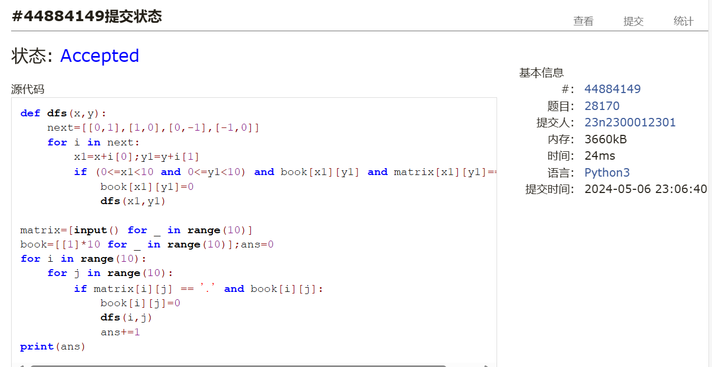
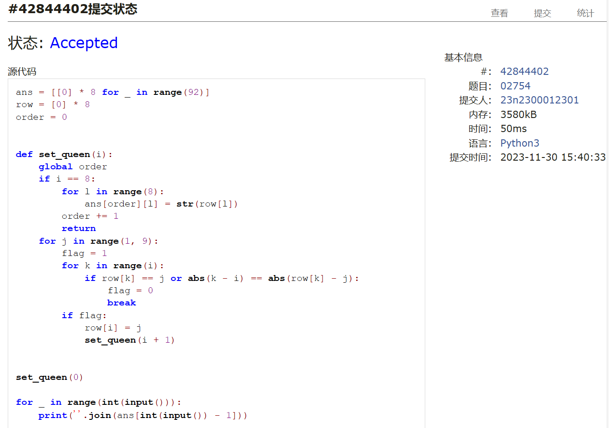
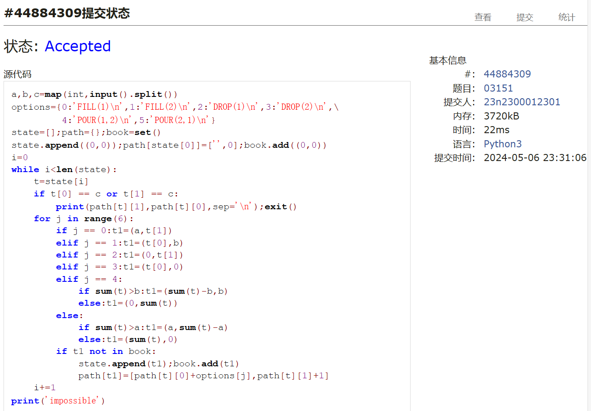
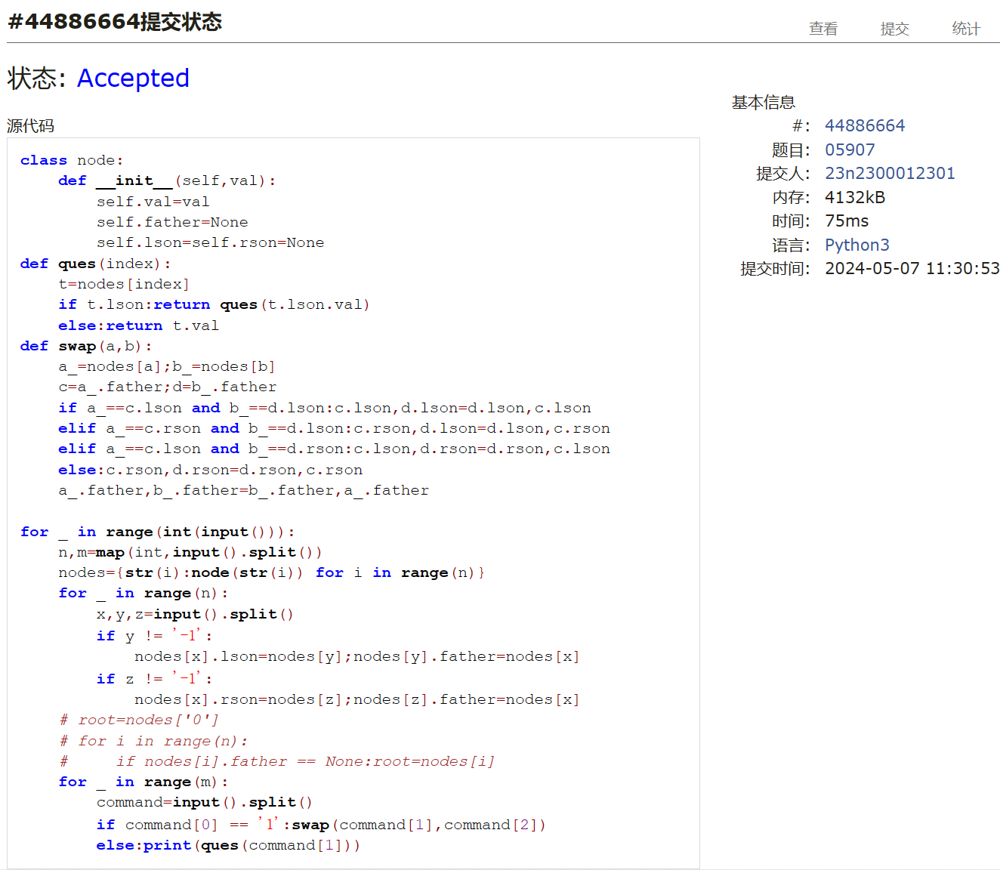
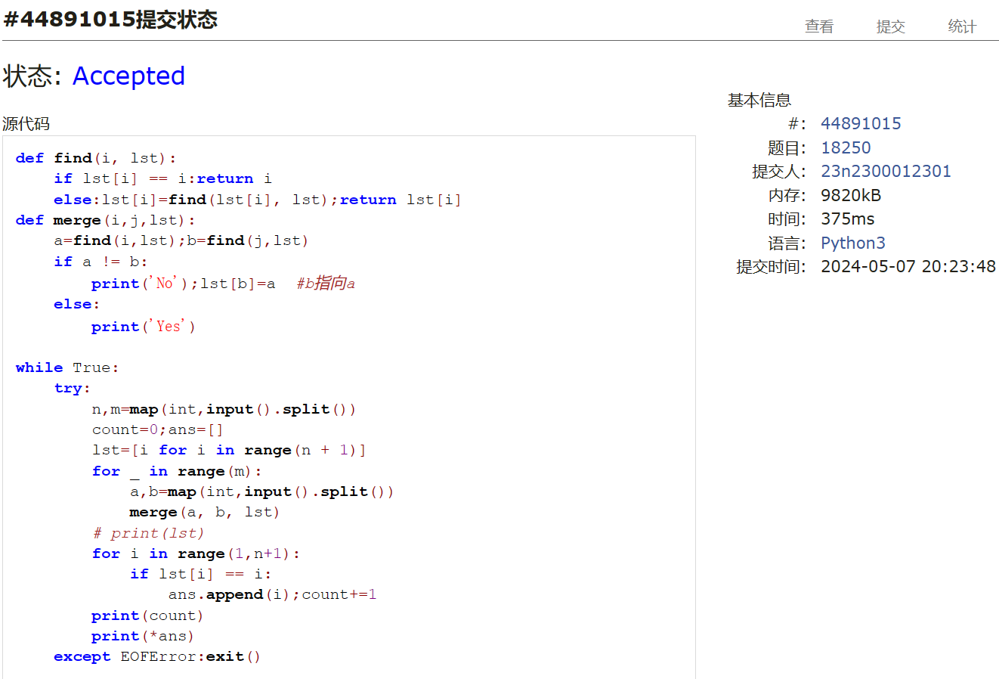
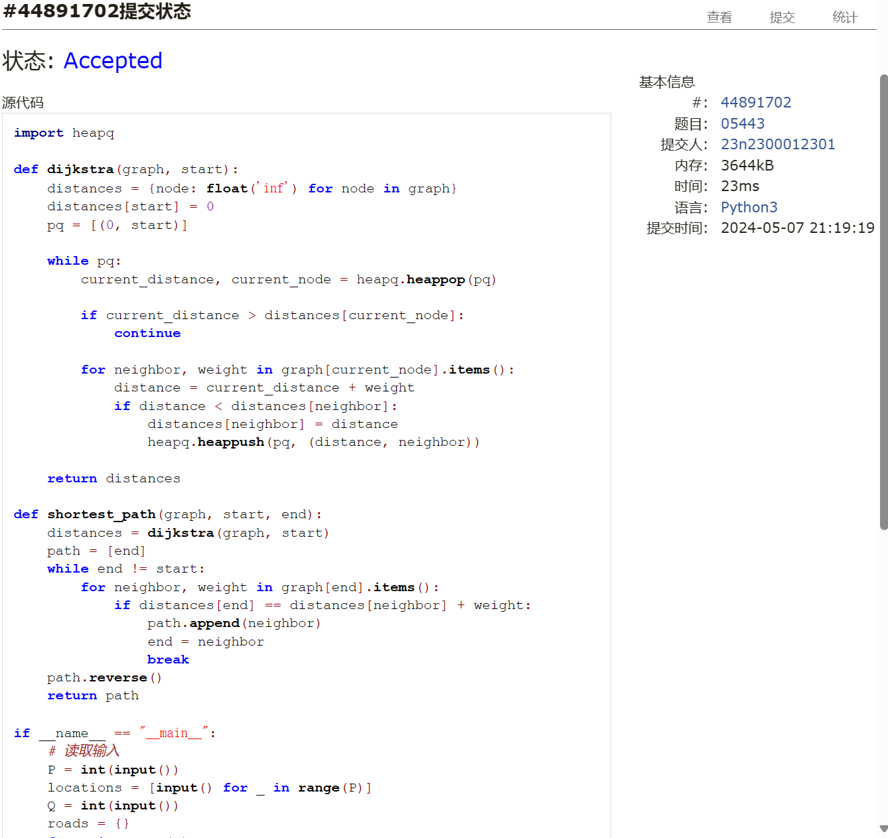
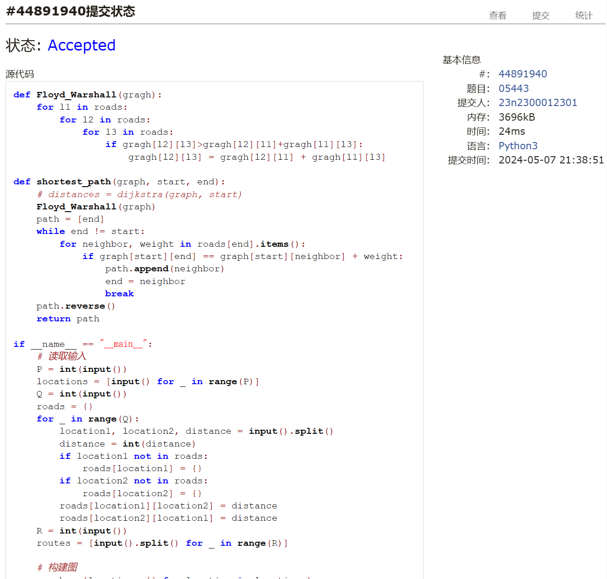

# Assignment #B: 图论和树算

Updated 1709 GMT+8 Apr 28, 2024

2024 spring, Complied by ==周百川，生命科学学院==


**说明：**

1）请把每个题目解题思路（可选），源码Python, 或者C++（已经在Codeforces/Openjudge上AC），截图（包含Accepted），填写到下面作业模版中（推荐使用 typora https://typoraio.cn ，或者用word）。AC 或者没有AC，都请标上每个题目大致花费时间。

2）提交时候先提交pdf文件，再把md或者doc文件上传到右侧“作业评论”。Canvas需要有同学清晰头像、提交文件有pdf、"作业评论"区有上传的md或者doc附件。

3）如果不能在截止前提交作业，请写明原因。


**编程环境**

==（请改为同学的操作系统、编程环境等）==

操作系统：Windows 11

Python编程环境：PyCharm 2023.1.4 (Community Edition)

C/C++编程环境：Visual Studio 2022

## 1. 题目

### 28170: 算鹰

dfs, http://cs101.openjudge.cn/practice/28170/


思路：


代码

```python
def dfs(x,y):
    next=[[0,1],[1,0],[0,-1],[-1,0]]
    for i in next:
        x1=x+i[0];y1=y+i[1]
        if (0<=x1<10 and 0<=y1<10) and book[x1][y1] and matrix[x1][y1]=='.':
            book[x1][y1]=0
            dfs(x1,y1)

matrix=[input() for _ in range(10)]
book=[[1]*10 for _ in range(10)];ans=0
for i in range(10):
    for j in range(10):
        if matrix[i][j] == '.' and book[i][j]:
            book[i][j]=0
            dfs(i,j)
            ans+=1
print(ans)

```


代码运行截图 ==（至少包含有"Accepted"）==



### 02754: 八皇后

dfs, http://cs101.openjudge.cn/practice/02754/


思路：


代码

```python
ans = [[0] * 8 for _ in range(92)]
row = [0] * 8
order = 0


def set_queen(i):
    global order
    if i == 8:
        for l in range(8):
            ans[order][l] = str(row[l])
        order += 1
        return
    for j in range(1, 9):
        flag = 1
        for k in range(i):
            if row[k] == j or abs(k - i) == abs(row[k] - j):
                flag = 0
                break
        if flag:
            row[i] = j
            set_queen(i + 1)


set_queen(0)

for _ in range(int(input())):
    print(''.join(ans[int(input()) - 1]))
```


代码运行截图 ==（至少包含有"Accepted"）==



### 03151: Pots

bfs, http://cs101.openjudge.cn/practice/03151/


思路：


代码

```python
a,b,c=map(int,input().split())
options={0:'FILL(1)\n',1:'FILL(2)\n',2:'DROP(1)\n',3:'DROP(2)\n',\
         4:'POUR(1,2)\n',5:'POUR(2,1)\n'}
state=[];path={};book=set()
state.append((0,0));path[state[0]]=['',0];book.add((0,0))
i=0
while i<len(state):
    t=state[i]
    if t[0] == c or t[1] == c:
        print(path[t][1],path[t][0],sep='\n');exit()
    for j in range(6):
        if j == 0:t1=(a,t[1])
        elif j == 1:t1=(t[0],b)
        elif j == 2:t1=(0,t[1])
        elif j == 3:t1=(t[0],0)
        elif j == 4:
            if sum(t)>b:t1=(sum(t)-b,b)
            else:t1=(0,sum(t))
        else:
            if sum(t)>a:t1=(a,sum(t)-a)
            else:t1=(sum(t),0)
        if t1 not in book:
            state.append(t1);book.add(t1)
            path[t1]=[path[t][0]+options[j],path[t][1]+1]
    i+=1
print('impossible')

```


代码运行截图 ==（AC代码截图，至少包含有"Accepted"）==



### 05907: 二叉树的操作

http://cs101.openjudge.cn/practice/05907/


思路：


代码

```python
class node:
    def __init__(self,val):
        self.val=val
        self.father=None
        self.lson=self.rson=None
def ques(index):
    t=nodes[index]
    if t.lson:return ques(t.lson.val)
    else:return t.val
def swap(a,b):
    a_=nodes[a];b_=nodes[b]
    c=a_.father;d=b_.father
    if a_==c.lson and b_==d.lson:c.lson,d.lson=d.lson,c.lson
    elif a_==c.rson and b_==d.lson:c.rson,d.lson=d.lson,c.rson
    elif a_==c.lson and b_==d.rson:c.lson,d.rson=d.rson,c.lson
    else:c.rson,d.rson=d.rson,c.rson
    a_.father,b_.father=b_.father,a_.father

for _ in range(int(input())):
    n,m=map(int,input().split())
    nodes={str(i):node(str(i)) for i in range(n)}
    for _ in range(n):
        x,y,z=input().split()
        if y != '-1':
            nodes[x].lson=nodes[y];nodes[y].father=nodes[x]
        if z != '-1':
            nodes[x].rson=nodes[z];nodes[z].father=nodes[x]
    # root=nodes['0']
    # for i in range(n):
    #     if nodes[i].father == None:root=nodes[i]
    for _ in range(m):
        command=input().split()
        if command[0] == '1':swap(command[1],command[2])
        else:print(ques(command[1]))

```


代码运行截图 ==（AC代码截图，至少包含有"Accepted"）==



### 18250: 冰阔落 I

Disjoint set, http://cs101.openjudge.cn/practice/18250/


思路：


代码

```python
def find(i, lst):
    if lst[i] == i:return i
    else:lst[i]=find(lst[i], lst);return lst[i]
def merge(i,j,lst):
    a=find(i,lst);b=find(j,lst)
    if a != b:
        print('No');lst[b]=a  #b指向a
    else:
        print('Yes')

while True:
    try:
        n,m=map(int,input().split())
        count=0;ans=[]
        lst=[i for i in range(n + 1)]
        for _ in range(m):
            a,b=map(int,input().split())
            merge(a, b, lst)
        # print(lst)
        for i in range(1,n+1):
            if lst[i] == i:
                ans.append(i);count+=1
        print(count)
        print(*ans)
    except EOFError:exit()

```


代码运行截图 ==（AC代码截图，至少包含有"Accepted"）==



### 05443: 兔子与樱花

http://cs101.openjudge.cn/practice/05443/


思路：

尝试了Dijkstra和Floyd_Warshall两种不同的算法，前者时间复杂度相对较优而后者编码更简洁，不过这里数据量太小导致看不出来用时的区别。

数据输入及路径输出部分参考了gpt的写法，感觉有些臃肿了，应该还可以再优化。

代码

```python
# Dijkstra
import heapq

def dijkstra(graph, start):
    distances = {node: float('inf') for node in graph}
    distances[start] = 0
    pq = [(0, start)]

    while pq:
        current_distance, current_node = heapq.heappop(pq)

        if current_distance > distances[current_node]:
            continue

        for neighbor, weight in graph[current_node].items():
            distance = current_distance + weight
            if distance < distances[neighbor]:
                distances[neighbor] = distance
                heapq.heappush(pq, (distance, neighbor))

    return distances

def shortest_path(graph, start, end):
    distances = dijkstra(graph, start)
    path = [end]
    while end != start:
        for neighbor, weight in graph[end].items():
            if distances[end] == distances[neighbor] + weight:
                path.append(neighbor)
                end = neighbor
                break
    path.reverse()
    return path

if __name__ == "__main__":
    # 读取输入
    P = int(input())
    locations = [input() for _ in range(P)]
    Q = int(input())
    roads = {}
    for _ in range(Q):
        location1, location2, distance = input().split()
        distance = int(distance)
        if location1 not in roads:
            roads[location1] = {}
        if location2 not in roads:
            roads[location2] = {}
        roads[location1][location2] = distance
        roads[location2][location1] = distance
    R = int(input())
    routes = [input().split() for _ in range(R)]

    # 构建图
    graph = {location: {} for location in locations}
    for location1 in roads:
        for location2 in roads[location1]:
            graph[location1][location2] = roads[location1][location2]

    # 计算最短路径并输出结果
    for route in routes:
        start, end = route
        path = shortest_path(graph, start, end)
        result = []
        for i in range(len(path) - 1):
            result.append(path[i] + "->(" + str(roads[path[i]][path[i+1]]) + ")->")
        result.append(path[-1])
        print("".join(result))

```
```python
# Floyd_Warshall
def Floyd_Warshall(gragh):
    for l1 in roads:
        for l2 in roads:
            for l3 in roads:
                if gragh[l2][l3]>gragh[l2][l1]+gragh[l1][l3]:
                    gragh[l2][l3] = gragh[l2][l1] + gragh[l1][l3]

def shortest_path(graph, start, end):
    # distances = dijkstra(graph, start)
    Floyd_Warshall(graph)
    path = [end]
    while end != start:
        for neighbor, weight in roads[end].items():
            if graph[start][end] == graph[start][neighbor] + weight:
                path.append(neighbor)
                end = neighbor
                break
    path.reverse()
    return path

if __name__ == "__main__":
    # 读取输入
    P = int(input())
    locations = [input() for _ in range(P)]
    Q = int(input())
    roads = {}
    for _ in range(Q):
        location1, location2, distance = input().split()
        distance = int(distance)
        if location1 not in roads:
            roads[location1] = {}
        if location2 not in roads:
            roads[location2] = {}
        roads[location1][location2] = distance
        roads[location2][location1] = distance
    R = int(input())
    routes = [input().split() for _ in range(R)]

    # 构建图
    graph = {location: {} for location in locations}
    for location1 in roads:
        for location2 in roads:
            if location2 in roads[location1]:
                graph[location1][location2] = roads[location1][location2]
            elif location2 == location1:
                graph[location1][location2] = 0
            else:graph[location1][location2]=float('inf')
    #print(graph)
    # 计算最短路径并输出结果
    for route in routes:
        start, end = route
        path = shortest_path(graph, start, end)
        result = []
        for i in range(len(path) - 1):
            result.append(path[i] + "->(" + str(roads[path[i]][path[i+1]]) + ")->")
        result.append(path[-1])
        print("".join(result))

```


代码运行截图 ==（AC代码截图，至少包含有"Accepted"）==




## 2. 学习总结和收获

==如果作业题目简单，有否额外练习题目，比如：OJ“2024spring每日选做”、CF、LeetCode、洛谷等网站题目。==

dfs和bfs的题目都比较熟练了，树的写法也练习了挺多的。并查集现在写得也还行。图的很多知识还没有完全掌握，有空会对图的最短路径、图的最小生成树之类的典型问题做一些总结。


