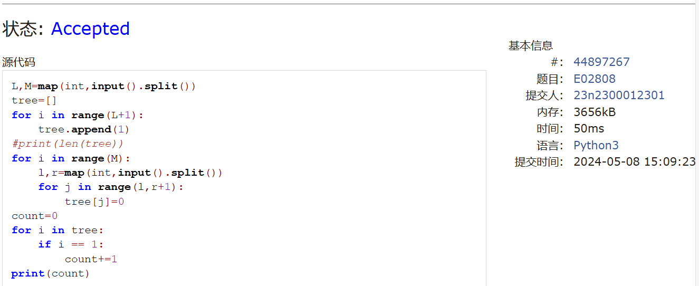
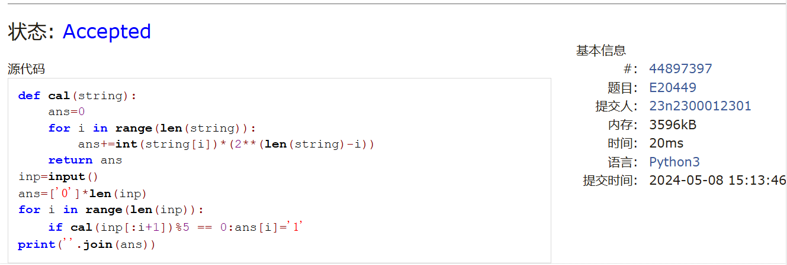
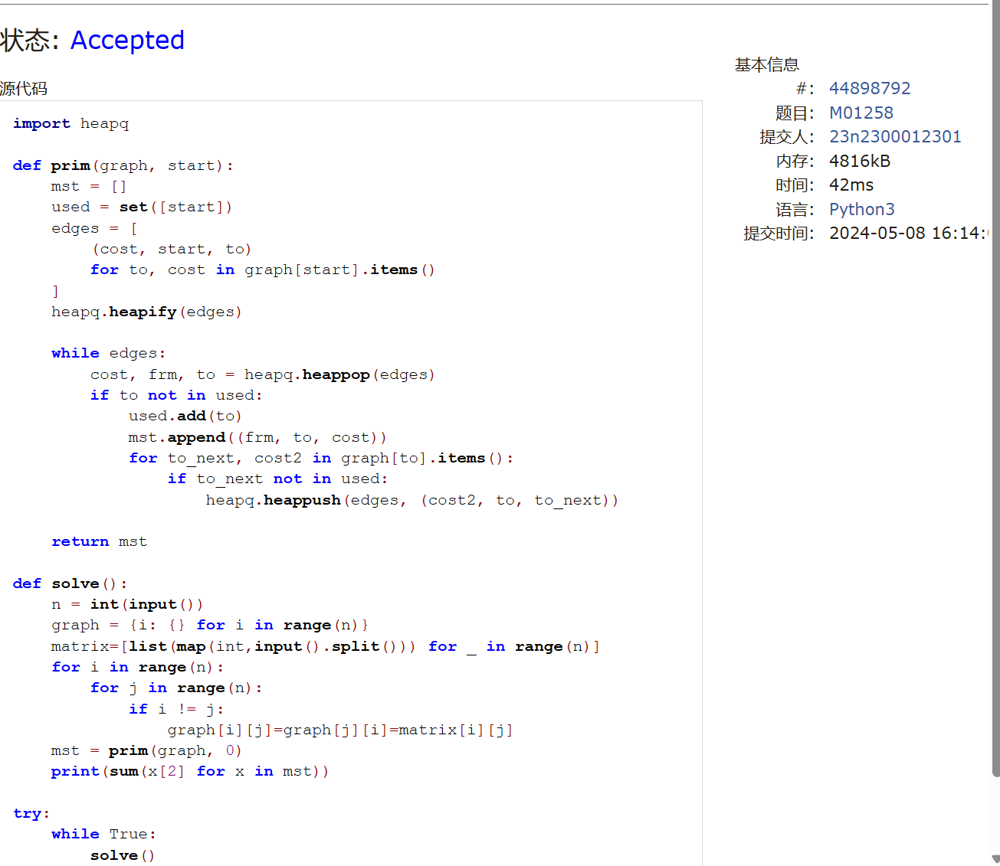
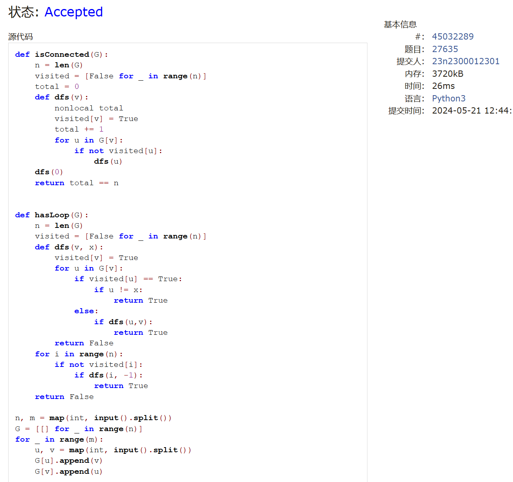
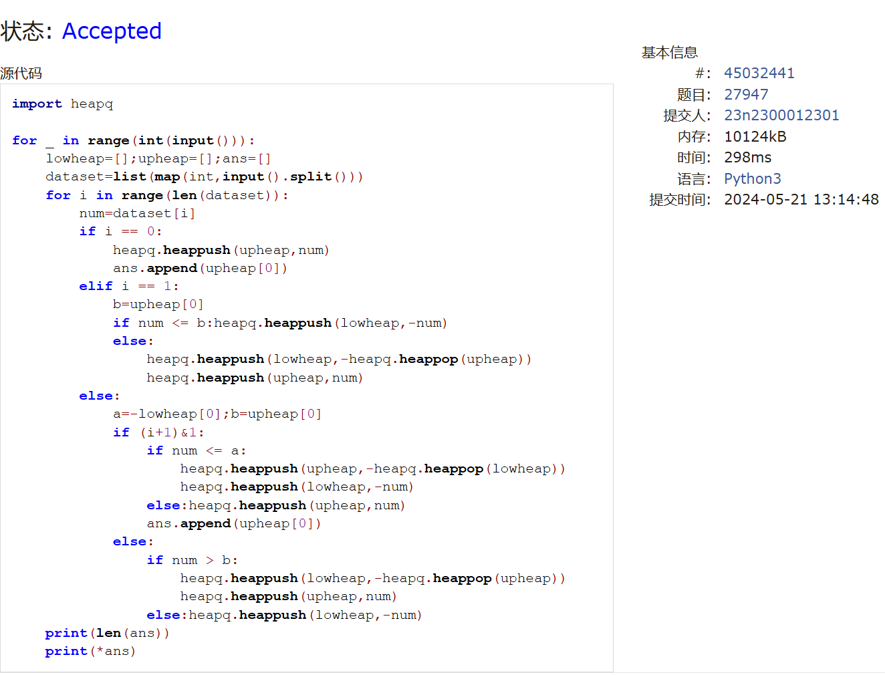
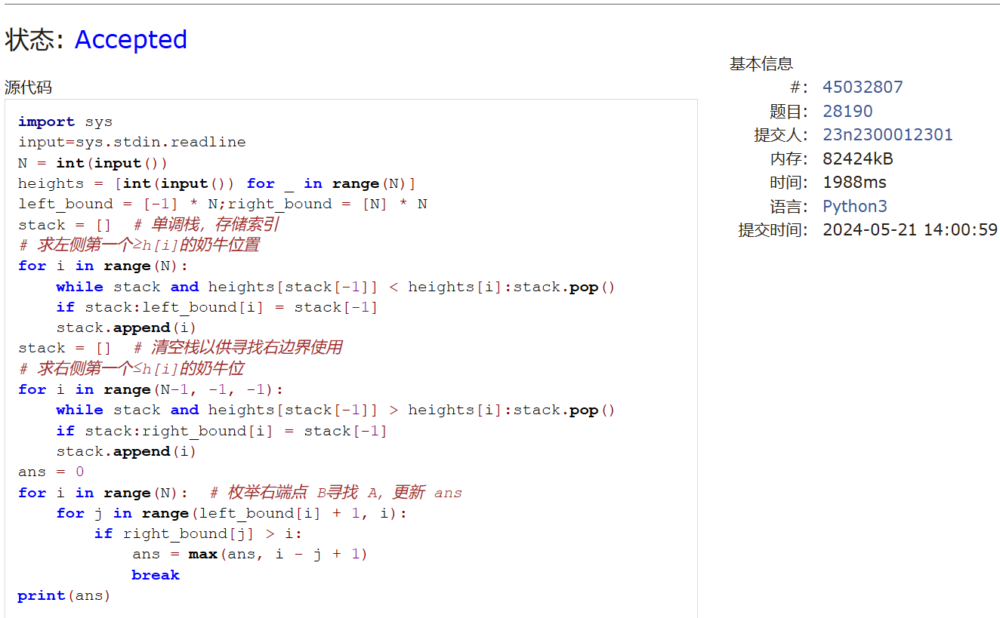

# Assignment #D: May月考

Updated 1654 GMT+8 May 8, 2024

2024 spring, Complied by ==周百川，生命科学学院==


**说明：**

1）请把每个题目解题思路（可选），源码Python, 或者C++（已经在Codeforces/Openjudge上AC），截图（包含Accepted），填写到下面作业模版中（推荐使用 typora https://typoraio.cn ，或者用word）。AC 或者没有AC，都请标上每个题目大致花费时间。

2）提交时候先提交pdf文件，再把md或者doc文件上传到右侧“作业评论”。Canvas需要有同学清晰头像、提交文件有pdf、"作业评论"区有上传的md或者doc附件。

3）如果不能在截止前提交作业，请写明原因。


**编程环境**

==（请改为同学的操作系统、编程环境等）==

操作系统：windows 11

Python编程环境：PyCharm 2023.1.4 (Community Edition)

C/C++编程环境：Visual Studio 2022


## 1. 题目

### 02808: 校门外的树

http://cs101.openjudge.cn/practice/02808/


思路：


代码

```python
L,M=map(int,input().split())
tree=[]
for i in range(L+1):
    tree.append(1)
#print(len(tree))
for i in range(M):
    l,r=map(int,input().split())
    for j in range(l,r+1):
        tree[j]=0
count=0
for i in tree:
    if i == 1:
        count+=1
print(count)

```


代码运行截图 ==（至少包含有"Accepted"）==



### 20449: 是否被5整除

http://cs101.openjudge.cn/practice/20449/


思路：


代码

```python
def cal(string):
    ans=0
    for i in range(len(string)):
        ans+=int(string[i])*(2**(len(string)-i))
    return ans
inp=input()
ans=['0']*len(inp)
for i in range(len(inp)):
    if cal(inp[:i+1])%5 == 0:ans[i]='1'
print(''.join(ans))

```


代码运行截图 ==（至少包含有"Accepted"）==



### 01258: Agri-Net

http://cs101.openjudge.cn/practice/01258/


思路：

Prim模板题。

代码

```python
import heapq

def prim(graph, start):
    mst = []
    used = set([start])
    edges = [
        (cost, start, to)
        for to, cost in graph[start].items()
    ]
    heapq.heapify(edges)

    while edges:
        cost, frm, to = heapq.heappop(edges)
        if to not in used:
            used.add(to)
            mst.append((frm, to, cost))
            for to_next, cost2 in graph[to].items():
                if to_next not in used:
                    heapq.heappush(edges, (cost2, to, to_next))

    return mst

def solve():
    n = int(input())
    graph = {i: {} for i in range(n)}
    matrix=[list(map(int,input().split())) for _ in range(n)]
    for i in range(n):
        for j in range(n):
            if i != j:
                graph[i][j]=graph[j][i]=matrix[i][j]
    mst = prim(graph, 0)
    print(sum(x[2] for x in mst))

try:
    while True:
        solve()
except EOFError:
    exit()

```


代码运行截图 ==（AC代码截图，至少包含有"Accepted"）==



### 27635: 判断无向图是否连通有无回路(同23163)

http://cs101.openjudge.cn/practice/27635/


思路：

参考了上次笔试中出现的代码。

代码

```python
def isConnected(G):  
    n = len(G)
    visited = [False for _ in range(n)]
    total = 0
    def dfs(v):
        nonlocal total
        visited[v] = True
        total += 1
        for u in G[v]:
            if not visited[u]:
                dfs(u)
    dfs(0)
    return total == n


def hasLoop(G):  
    n = len(G)
    visited = [False for _ in range(n)]
    def dfs(v, x): 
        visited[v] = True
        for u in G[v]:
            if visited[u] == True:
                if u != x:  
                    return True
            else:
                if dfs(u,v):  
                    return True
        return False
    for i in range(n):
        if not visited[i]:  
            if dfs(i, -1):
                return True
    return False

n, m = map(int, input().split())
G = [[] for _ in range(n)]
for _ in range(m):
    u, v = map(int, input().split())
    G[u].append(v)
    G[v].append(u)

if isConnected(G):
    print("connected:yes")
else:
    print("connected:no")

if hasLoop(G):
    print("loop:yes")
else:
    print("loop:no")

```


代码运行截图 ==（AC代码截图，至少包含有"Accepted"）==



### 27947: 动态中位数

http://cs101.openjudge.cn/practice/27947/


思路：

考试时用了bisect,TLE,后来了解到bisect的insert是O(n)的。之后换了堆。

要维护一个最大堆和一个最小堆。

代码

```python
import heapq

for _ in range(int(input())):
    lowheap=[];upheap=[];ans=[]
    dataset=list(map(int,input().split()))
    for i in range(len(dataset)):
        num=dataset[i]
        if i == 0:
            heapq.heappush(upheap,num)
            ans.append(upheap[0])
        elif i == 1:
            b=upheap[0]
            if num <= b:heapq.heappush(lowheap,-num)
            else:
                heapq.heappush(lowheap,-heapq.heappop(upheap))
                heapq.heappush(upheap,num)
        else:
            a=-lowheap[0];b=upheap[0]
            if (i+1)&1:
                if num <= a:
                    heapq.heappush(upheap,-heapq.heappop(lowheap))
                    heapq.heappush(lowheap,-num)
                else:heapq.heappush(upheap,num)
                ans.append(upheap[0])
            else:
                if num > b:
                    heapq.heappush(lowheap,-heapq.heappop(upheap))
                    heapq.heappush(upheap,num)
                else:heapq.heappush(lowheap,-num)
    print(len(ans))
    print(*ans)

```


代码运行截图 ==（AC代码截图，至少包含有"Accepted"）==



### 28190: 奶牛排队

http://cs101.openjudge.cn/practice/28190/


思路：

参考了题解的代码，单调栈的相关知识应用还需要进一步练习。

代码

```python
import sys
input=sys.stdin.read
N = int(input())
heights = [int(input()) for _ in range(N)]
left_bound = [-1] * N;right_bound = [N] * N
stack = []  # 单调栈，存储索引
# 求左侧第一个≥h[i]的奶牛位置
for i in range(N):
    while stack and heights[stack[-1]] < heights[i]:stack.pop()
    if stack:left_bound[i] = stack[-1]
    stack.append(i)
stack = []  # 清空栈以供寻找右边界使用
# 求右侧第一个≤h[i]的奶牛位
for i in range(N-1, -1, -1):
    while stack and heights[stack[-1]] > heights[i]:stack.pop()
    if stack:right_bound[i] = stack[-1]
    stack.append(i)
ans = 0
for i in range(N):  # 枚举右端点 B寻找 A，更新 ans
    for j in range(left_bound[i] + 1, i):
        if right_bound[j] > i:
            ans = max(ans, i - j + 1)
            break
print(ans)

```


代码运行截图 ==（AC代码截图，至少包含有"Accepted"）==



## 2. 学习总结和收获

==如果作业题目简单，有否额外练习题目，比如：OJ“2024spring每日选做”、CF、LeetCode、洛谷等网站题目。==

最近笔试机考之类的有点忙，在努力学习一些偏理论的知识。
图的相关算法比如Dijkstra,Prim,Kruskal之类的更熟练了，之后会做一些系统的总结。


