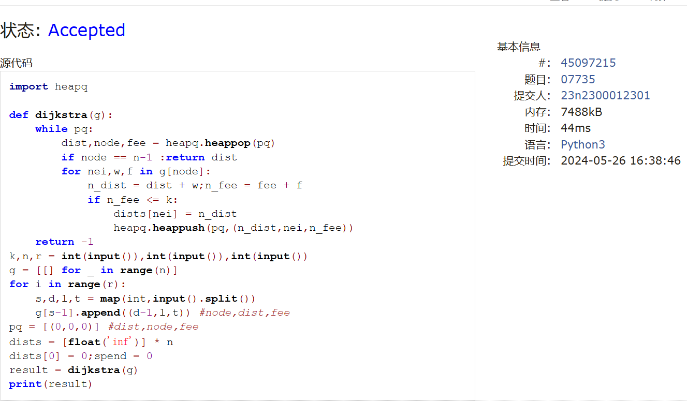

# Assignment #F: All-Killed 满分

Updated 1844 GMT+8 May 20, 2024

2024 spring, Complied by ==周百川，生命科学学院==


**说明：**

1）请把每个题目解题思路（可选），源码Python, 或者C++（已经在Codeforces/Openjudge上AC），截图（包含Accepted），填写到下面作业模版中（推荐使用 typora https://typoraio.cn ，或者用word）。AC 或者没有AC，都请标上每个题目大致花费时间。

2）提交时候先提交pdf文件，再把md或者doc文件上传到右侧“作业评论”。Canvas需要有同学清晰头像、提交文件有pdf、"作业评论"区有上传的md或者doc附件。

3）如果不能在截止前提交作业，请写明原因。


**编程环境**

==（请改为同学的操作系统、编程环境等）==

操作系统：Windows 11

Python编程环境：PyCharm 2023.1.4 (Community Edition)

C/C++编程环境：Visual Studio 2022

## 1. 题目

### 22485: 升空的焰火，从侧面看

http://cs101.openjudge.cn/practice/22485/


思路：


代码

```python
import queue
class Node:
    def __init__(self,val):
        self.l,self.r,self.val=None,None,val
n=int(input())
nodes=[0]+[Node(i) for i in range(1,n+1)]
nodes.append(None)
for i in range(1,n+1):
    a,b=map(int,input().split())
    nodes[i].l,nodes[i].r=nodes[a],nodes[b]
vis=set([1]);que=queue.Queue();ans=[1]
que.put([nodes[1],1])
while not que.empty():
    t=que.get()
    if t[0].l and t[0].l.val not in vis:
        vis.add(t[0].l.val);que.put([t[0].l,t[1]+1])
    if t[0].r and t[0].r.val not in vis:
        vis.add(t[0].r.val);que.put([t[0].r,t[1]+1])
    if t[1] > len(ans):ans.append(t[0].val)
    else:ans[-1]=t[0].val
print(*ans)

```


代码运行截图 ==（至少包含有"Accepted"）==


### 28203:【模板】单调栈

http://cs101.openjudge.cn/practice/28203/


思路：

单调栈模板，需要熟练掌握。

代码

```python
n=int(input())
ans=[0]*n;stack=[]
num=list(map(int,input().split()))
for i in range(n-1,-1,-1):
    while stack and num[stack[-1]] <= num[i]:
        stack.pop()
    ans[i]=stack[-1]+1 if stack else 0
    stack.append(i)
print(*ans)


```


代码运行截图 ==（至少包含有"Accepted"）==


### 09202: 舰队、海域出击！

http://cs101.openjudge.cn/practice/09202/


思路：

用了思路比较简单的dfs。

代码

```python
def has_cycle(n, m):
    def dfs(node, visited, recursion_stack):
        visited[node] = True
        recursion_stack[node] = True
        for neighbor in graph[node]:
            if not visited[neighbor]:
                if dfs(neighbor, visited, recursion_stack):
                    return True
            elif recursion_stack[neighbor]:
                return True
        recursion_stack[node] = False
        return False

    # 对每个节点进行深度优先搜索
    visited = [False] * (n+1)
    recursion_stack = [False] * (n+1)
    for i in range(1, n+1):
        if not visited[i]:
            if dfs(i, visited, recursion_stack):
                return "Yes"
    return "No"

T = int(input())  # 测试组数
for _ in range(T):
    N, M = map(int, input().split())  # 既定目标数、航线数
    graph = [[] for _ in range(N + 1)]
    for _ in range(M):
        x, y = map(int, input().split())  # 航线的起点和终点
        graph[x].append(y)
    result = has_cycle(N, M)
    print(result)

```


代码运行截图 ==（AC代码截图，至少包含有"Accepted"）==


### 04135: 月度开销

http://cs101.openjudge.cn/practice/04135/


思路：

二分查找，跟河中跳房子那题差不多。

代码

```python
def calculate_max_expense(N,M,expenses):
    sum_expenses=sum(expenses)
    low=max(expenses);high=sum_expenses
    while low < high:
        mid=(low+high)//2;current_expense=0;count=1
        for expense in expenses:
            if current_expense + expense > mid:
                current_expense = expense;count += 1
            else:current_expense += expense
        if count > M:low = mid + 1
        else:high = mid
    return low
N, M = map(int, input().split())
expenses = [int(input()) for _ in range(N)]
result = calculate_max_expense(N, M, expenses)
print(result)

```


代码运行截图 ==（AC代码截图，至少包含有"Accepted"）==


### 07735: 道路

http://cs101.openjudge.cn/practice/07735/


思路：

Dijkstra变体，思路上有一些难度

代码

```python
import heapq

def dijkstra(g):
    while pq:
        dist,node,fee = heapq.heappop(pq)
        if node == n-1 :return dist
        for nei,w,f in g[node]:
            n_dist = dist + w;n_fee = fee + f
            if n_fee <= k:
                dists[nei] = n_dist
                heapq.heappush(pq,(n_dist,nei,n_fee))
    return -1
k,n,r = int(input()),int(input()),int(input())
g = [[] for _ in range(n)]
for i in range(r):
    s,d,l,t = map(int,input().split())
    g[s-1].append((d-1,l,t)) #node,dist,fee
pq = [(0,0,0)] #dist,node,fee
dists = [float('inf')] * n
dists[0] = 0;spend = 0
result = dijkstra(g)
print(result)

```


代码运行截图 ==（AC代码截图，至少包含有"Accepted"）==



### 01182: 食物链

http://cs101.openjudge.cn/practice/01182/


思路：

参考了题解的思路，是稍有变化的并查集。

代码

```python
def find(x):  # 并查集查询
    if p[x] == x:return x
    else:
        p[x] = find(p[x]);return p[x]
n, k = map(int, input().split())
p = [0] * (3 * n + 1);ans = 0
for i in range(3 * n + 1):  # 并查集初始化
    p[i] = i
for _ in range(k):
    a, x, y = map(int, input().split())
    if x > n or y > n:ans += 1;continue
    if a == 1:
        if find(x + n) == find(y) or find(y + n) == find(x):
            ans += 1;continue
        p[find(x)] = find(y)
        p[find(x + n)] = find(y + n)
        p[find(x + 2 * n)] = find(y + 2 * n)
    else:
        if find(x) == find(y) or find(y + n) == find(x):
            ans += 1;continue
        p[find(x + n)] = find(y)
        p[find(y + 2 * n)] = find(x)
        p[find(x + 2 * n)] = find(y + n)
print(ans)

```


代码运行截图 ==（AC代码截图，至少包含有"Accepted"）==


## 2. 学习总结和收获

==如果作业题目简单，有否额外练习题目，比如：OJ“2024spring每日选做”、CF、LeetCode、洛谷等网站题目。==

最近快到期末了ddl比较多，也逐渐开始系统地整理本学期学过的知识以准备即将到来的上机考试。

在洛谷上做了一些模板题来巩固基本的代码框架。


