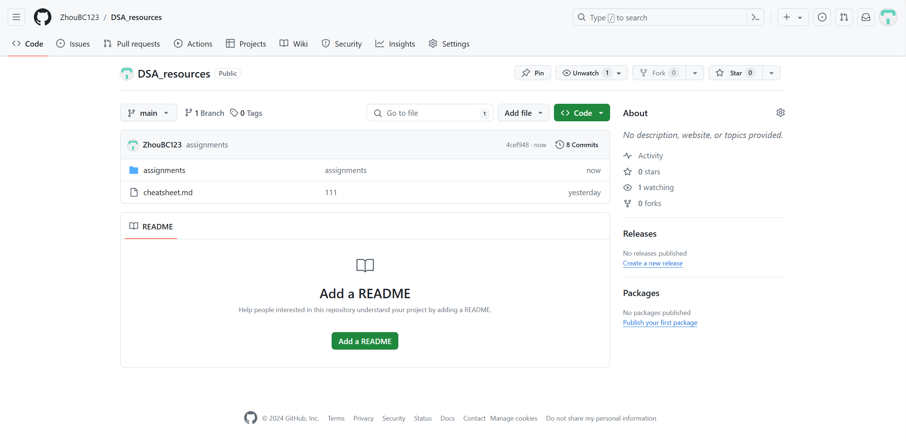
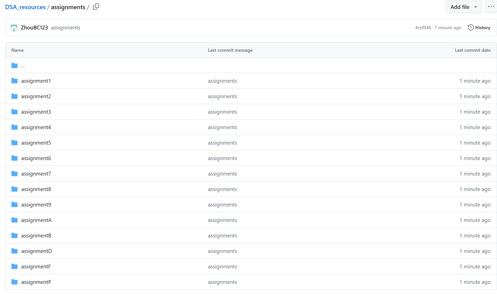

# Assignment #P: 课程大作业

Updated 1009 GMT+8 Feb 28, 2024

2024 spring, Complied by ==同学的姓名、院系==

**说明：**

关乎每位同学维护自己的 GitHub 作业，本意是让大家练习常用于计算机科学学生的代码和文档维护方法。通过计算概论、数据结构和算法等课程，我们希望引导大家进入计算机学科领域。这将帮助同学们熟悉实际的编码和文档管理流程，并培养在团队协作和版本控制方面的技能。

1）提交内容，请填写到下面作业模版中。

2）截止时间是期末出分前，因为Canvas可以多次提交，建议期末机考前提交一次，考试后加上课程总结再提交一次。

评分标准

| 标准           | 等级                                   | 得分       |
| -------------- | -------------------------------------- | ---------- |
| 按时提交       | 1 得分提交，0.5 得分请假，0 得分未提交 | 1 分       |
| 你的GitHub网址 | 1 得分有，0 得分无                     | 1 分       |
| 你的GitHub截图 | 1 得分有，0 得分无                     | 1 分       |
| Cheatsheet     | 1 得分有，0 得分无                     | 1 分       |
| 课程资料和情报 | 1 得分有，0 得分无                     | 1 分       |
| 总得分：       |                                        | 5 ，满分 5 |

## 1. 要求

同学开自己的GitHub，自己数算的学习方法、做的题目、考试时候要带的记录纸（cheat_sheet）等放在上面。方便大家关注，当你有新的更新时，我们也可以及时获得最新的内容。

例子1：https://github.com/forxhunter/libpku 这样的项目可以作为一个数算课程的项目，同时也是同学们整理资料的一个好方式，可以实现一举多得的效果。

例子2: https://github.com/PKUanonym/REKCARC-TSC-UHT

## 2. 提交内容

你的GitHub网址及截图。

网址：https://github.com/ZhouBC123/DSA_resources

## 3. 课程总结

如果愿意，请同学或多或少做一个本门课程的学习总结。便于之后师弟师妹跟进学习，也便于教师和助教改进教学。例如：分享自己的学习心得、笔记。

也是在闫老师与同学们的陪伴下走过了大一一年的旅程，很幸运能在刚进入大学的时候就遇到了这样一位好老师。
课程群的讨论氛围非常好，基本上问了gpt、查了资料也不懂的问题发到群里不出半天就会被完美解决，在此也感谢群里的各位大佬的帮助。
我在班里同学中刷的题目数量应该只能算中位数，但也在制作cheatsheet的指导下对做过的题目进行了一些个人的总结，这对于高度模板化的DSA课程来说还是很有帮助的(个人比起计概有时候的灵光一闪还是更擅长数算的模板总结)。
计概最终是AC5，T2动规没做出来是在意料之中的；数算机考AC6，也印证了我可能更擅长模板化的题目(说来惭愧，由于食物链那题直到考前也没有完全搞懂所以只是把代码贴到了cheatsheet里，因此做M4的时候根本没忘食物链上想)。
数算笔试由于连续考试只能6h速通，最终AC4也挺满意了。

想对正在考虑是否要选这门课的学弟学妹们说，这门课最大的挑战不是课程作业和考试的难度，而是自学和查找信息的能力。如果你更习惯于从课堂上获取主要知识而不是在课下的自主练习与搜寻资料中获得，那我其实是并不很推荐选这门课的。
但换个角度想想，本科也是能从课堂上收获大量知识的最后阶段了；再以后的知识都需要依赖自学。所以从这个角度来说，闫老师的这门课也是提升自学能力的一个途径吧。

计概+数算两学期的课程结束了，我也将在cs双学位的学习中继续与计算机的旅程(就是不知道后面还有没有这样的好课了hhh)。感谢闫老师与同学们一年来的帮助，也希望未来仍然能够与大家多多交流。

最后祝大家假期愉快！

## 参考

1.科学上网 Scientific Internet

北大学长提供的Clash，请自己取用。
https://189854.xyz/verify/
https://blog.189854.xyz/blog/walless/2023/11/04/clash.html

2.图床，把图片放到云上去，而不是本地的意思。如果设置图床，分享md文件，其他人也能看到图片；否则因为md嵌入的图片在本地，只有编辑者能看到；后者的情况解决方法还可以是导出包含图片的pdf文件分享。图床如果是免费的，过一阵可能会失效，之前用过非github的免费图床，导致链接失效了。github是免费的，目前比较稳定。

1）Typora + GitHub = 效率，https://mp.weixin.qq.com/s/hmkGZln-xatrWrBZrY9t-g

2）Typora+PicGo+Github解决个人博客图片上传问题 https://zhuanlan.zhihu.com/p/367529569

3）设置的图床目录是Public

3.Github图片不显示，原因是DNS污染。两种解决方法，或者直接添加1）给出的ip列表，或者2）自己找出ip添加。

1）Github图片显示不出来？两步解决！ https://zhuanlan.zhihu.com/p/345258967?utm_id=0&wd=&eqid=ce16938700061ac4000000056470d782 。

2）https://www.ipaddress.com查到ip，添加到hosts后，在移动宽带网络中，可以显示md中的图片。 参考：解决raw.githubusercontent.com无法访问的问题（picgo+github配置图床图片不显示，但仓库已存储成功），https://blog.51cto.com/reliableyang/6457392.  

